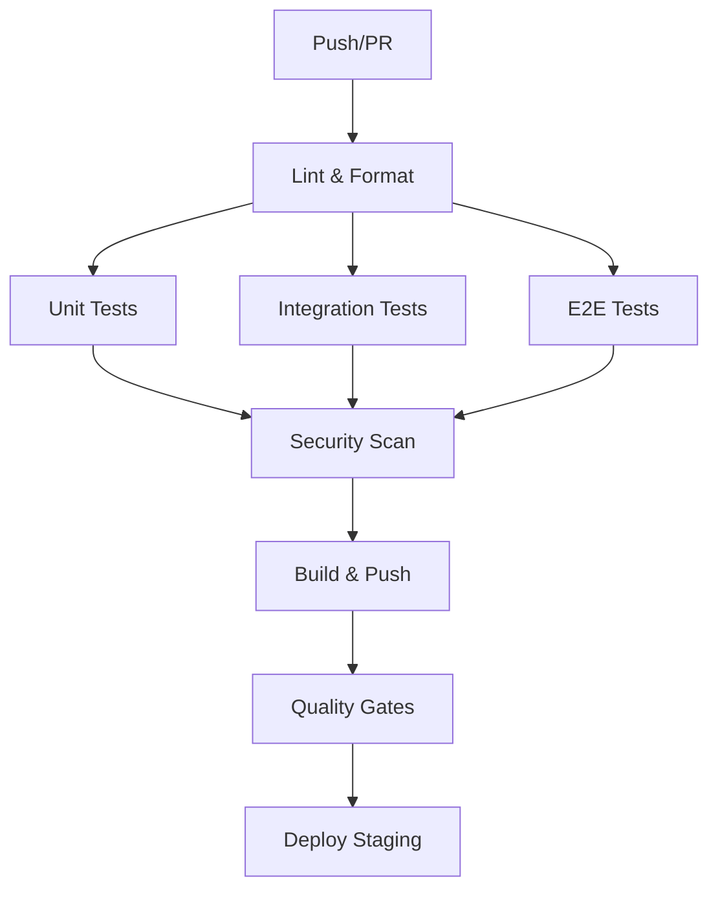
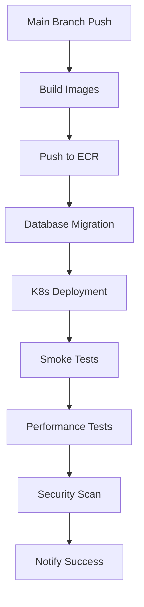
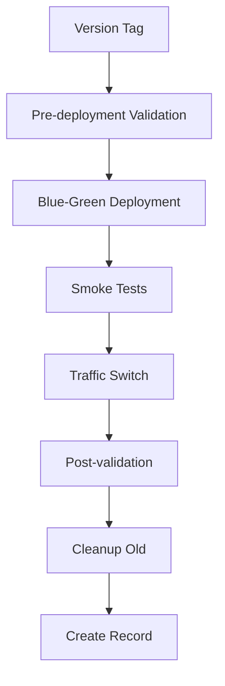

# BioPoint CI/CD Pipeline

## 🚀 Quick Start

### Deploy to Staging
```bash
# Trigger staging deployment (automated on main branch push)
gh workflow run deploy-staging.yml

# Monitor deployment
gh run watch --workflow=deploy-staging.yml
```

### Deploy to Production
```bash
# Create version tag (triggers automated deployment)
git tag -a v1.2.3 -m "Release version 1.2.3"
git push origin v1.2.3

# Monitor deployment
gh run watch --workflow=deploy-production.yml
```

### Emergency Rollback
```bash
# One-click rollback
gh workflow run rollback-production.yml -f rollback_reason="Critical issue detected"
```

## 📋 Pipeline Overview

The BioPoint CI/CD pipeline is a comprehensive, automated deployment system designed for healthcare applications with strict security and compliance requirements.

### Key Features

- **🔒 Security-First**: HIPAA-compliant with comprehensive security scanning
- **⚡ High Performance**: Parallel execution with intelligent caching
- **🔄 Blue-Green Deployments**: Zero-downtime production deployments
- **🚨 Automated Rollback**: One-click rollback with health monitoring
- **📊 Quality Gates**: 80% test coverage, TypeScript validation, compliance checks
- **🔍 Comprehensive Monitoring**: Real-time metrics and alerting

### Pipeline Architecture

```
┌─────────────────┐    ┌──────────────────┐    ┌──────────────────┐
│   CI Pipeline   │    │ Staging Deploy   │    │ Production Deploy│
│                 │    │                  │    │                  │
│ • Lint          │───▶│ • Build & Push   │───▶│ • Pre-validation │
│ • Test          │    │ • Deploy K8s     │    │ • Blue-Green     │
│ • Security Scan │    │ • Smoke Tests    │    │ • Traffic Switch │
│ • Build         │    │ • Health Checks  │    │ • Post-validation│
└─────────────────┘    └──────────────────┘    └──────────────────┘
```

## 🏗️ Workflow Files

### Core Workflows

| Workflow | File | Trigger | Purpose |
|----------|------|---------|---------|
| **CI Pipeline** | `.github/workflows/ci.yml` | Push/PR | Code quality, testing, security |
| **Staging Deploy** | `.github/workflows/deploy-staging.yml` | Main branch | Automated staging deployment |
| **Production Deploy** | `.github/workflows/deploy-production.yml` | Version tags | Blue-green production deployment |
| **Security Scan** | `.github/workflows/security-scan.yml` | Daily | Comprehensive security assessment |
| **Emergency Rollback** | `.github/workflows/rollback-production.yml` | Manual | One-click emergency rollback |

## 🔧 Configuration

### Prerequisites

1. **GitHub Repository Secrets**
   ```bash
   # AWS Credentials
   AWS_ACCESS_KEY_ID
   AWS_SECRET_ACCESS_KEY
   
   # Doppler Token
   DOPPLER_TOKEN
   DOPPLER_TOKEN_STAGING
   DOPPLER_TOKEN_PRODUCTION
   
   # Slack Webhook
   SLACK_WEBHOOK
   
   # Security Tools
   SNYK_TOKEN
   GITLEAKS_LICENSE
   CODECOV_TOKEN
   ```

2. **GitHub Environments**
   - `staging`: No protection rules
   - `production`: Required reviewers

3. **AWS Resources**
   - EKS Cluster: `biopoint-staging`, `biopoint-production`
   - ECR Registry: `biopoint-api`, `biopoint-mobile`
   - S3 Buckets: `biopoint-deployments`, `biopoint-logs`

### Environment Setup

```bash
# Install required tools
npm install -g turbo doppler-cli gh

# Configure Doppler
doppler login
doppler setup

# Configure GitHub CLI
gh auth login
```

## 🚀 Deployment Process

### 1. CI Pipeline (Every Push/PR)



**Jobs**:
- **Lint**: Code quality validation
- **Test**: Unit, integration, E2E tests (80% coverage required)
- **Security Scan**: Dependency, code, container scanning
- **Build**: Docker images with multi-arch support
- **Quality Gates**: Coverage, TypeScript, compliance validation

### 2. Staging Deployment (Main Branch)



**Features**:
- Automated on main branch push
- Database migrations with backup
- Comprehensive smoke testing
- Performance validation
- Security scanning

### 3. Production Deployment (Version Tags)



**Features**:
- Blue-green deployment strategy
- Zero-downtime traffic switching
- Automated rollback on failure
- Comprehensive post-deployment validation

## 🔒 Security Features

### Security Scanning

- **Dependency Scanning**: npm audit, Snyk
- **Code Scanning**: Semgrep, ESLint security rules
- **Secret Detection**: Gitleaks
- **Container Scanning**: Trivy, Docker Bench
- **Infrastructure Scanning**: Checkov, tfsec
- **Web Application Scanning**: OWASP ZAP
- **Compliance Scanning**: HIPAA, PHI encryption

### Security Validation

```bash
# Run security tests
npm run test:security

# Validate encryption
npm run encryption:validate

# Check for hardcoded secrets
npm run secrets:audit
```

## 🧪 Testing Strategy

### Test Types

- **Unit Tests**: Jest with 80% coverage requirement
- **Integration Tests**: Supertest API testing
- **E2E Tests**: Playwright browser automation
- **Security Tests**: Automated security validation
- **Compliance Tests**: HIPAA compliance validation

### Test Execution

```bash
# Run all tests
npm run test:all

# Run specific test types
npm run test:unit
npm run test:integration
npm run test:e2e
npm run test:security
npm run test:compliance
```

## 📊 Monitoring & Observability

### Metrics Collection

- **Application Metrics**: Response time, error rate, throughput
- **Infrastructure Metrics**: CPU, memory, disk, network
- **Security Metrics**: Vulnerability count, scan results
- **Business Metrics**: User activity, feature usage

### Alerting

- **Slack**: #devops-alerts, #security-alerts
- **PagerDuty**: Critical incidents
- **Email**: Daily summaries
- **SMS**: Production outages

### Monitoring Commands

```bash
# Check application health
curl https://api.biopoint.health/health

# View metrics
curl https://api.biopoint.health/metrics

# Check database health
doppler run -- npm run db:health
```

## 🔄 Rollback Procedures

### Automatic Rollback

Triggered by:
- Health check failures
- Error rate > 5% for 5 minutes
- Response time > 5 seconds for 10 minutes

### Manual Rollback

```bash
# One-click rollback
gh workflow run rollback-production.yml \
  -f rollback_reason="Performance degradation observed"

# Manual traffic switch
kubectl patch service biopoint-production-service \
  -p '{"spec":{"selector":{"color":"green"}}}'
```

### Rollback Validation

```bash
# Verify rollback
./scripts/run-smoke-tests.sh production

# Check system stability
kubectl top pods -n biopoint-production
```

## 🛠️ Deployment Scripts

### Script Overview

| Script | Purpose | Usage |
|--------|---------|-------|
| `deploy-staging.sh` | Staging deployment | `./scripts/deploy-staging.sh` |
| `deploy-production.sh` | Production deployment | `./scripts/deploy-production.sh blue v1.2.3` |
| `run-smoke-tests.sh` | Post-deployment validation | `./scripts/run-smoke-tests.sh production` |

### Script Features

- **Error Handling**: Comprehensive error detection and handling
- **Logging**: Detailed logging with color-coded output
- **Validation**: Extensive pre and post-deployment validation
- **Rollback**: Automatic rollback on failure
- **Notification**: Slack integration for status updates

## 📋 Quality Gates

### Requirements

- **Test Coverage**: Minimum 80%
- **Security**: No critical/high vulnerabilities
- **Performance**: Response time < 1 second
- **Compliance**: HIPAA validation passing
- **TypeScript**: No compilation errors

### Quality Checks

```bash
# Check test coverage
npm run test:coverage

# Validate security
npm run test:security

# Check compliance
npm run test:compliance
```

## 🔧 Troubleshooting

### Common Issues

#### Deployment Failures

```bash
# Check pod status
kubectl get pods -n biopoint-production

# View logs
kubectl logs -f deployment/biopoint-api -n biopoint-production

# Check events
kubectl get events -n biopoint-production --sort-by='.lastTimestamp'
```

#### Database Issues

```bash
# Check migration status
doppler run -- npm run db:migrate:status

# Test connectivity
doppler run -- npm run db:health
```

#### Performance Issues

```bash
# Check metrics
curl https://api.biopoint.health/metrics | jq

# View resource usage
kubectl top pods -n biopoint-production
```

### Debug Commands

```bash
# CI pipeline debug
gh run view --log --job=<job-id>

# Kubernetes debug
kubectl describe pod <pod-name> -n biopoint-production

# Application debug
doppler run -- npm run debug
```

## 📚 Documentation

### Available Documentation

- **[CI/CD Pipeline](ci-cd-pipeline.md)**: Comprehensive pipeline documentation
- **[Deployment Runbook](deployment-runbook.md)**: Step-by-step deployment procedures
- **[Rollback Procedures](rollback-procedures.md)**: Detailed rollback instructions

### Documentation Updates

Documentation is automatically updated when:
- Pipeline configuration changes
- New security requirements
- Deployment procedures updated
- Best practices evolved

## 🤝 Contributing

### Development Process

1. **Fork** the repository
2. **Create** feature branch (`git checkout -b feature/amazing-feature`)
3. **Commit** changes (`git commit -m 'Add amazing feature'`)
4. **Push** to branch (`git push origin feature/amazing-feature`)
5. **Open** Pull Request

### Code Standards

- **TypeScript**: Strict mode enabled
- **Testing**: 80% coverage minimum
- **Security**: No vulnerabilities
- **Documentation**: Update docs for changes

### Security

- **Never** commit secrets
- **Always** use environment variables
- **Regularly** update dependencies
- **Follow** security best practices

## 📞 Support

### Emergency Contacts

- **DevOps On-Call**: +1-XXX-XXX-XXXX
- **Security Team**: security@biopoint.health
- **Platform Team**: platform@biopoint.health

### Documentation

- **Status Page**: https://status.biopoint.health
- **Metrics Dashboard**: https://metrics.biopoint.health
- **API Documentation**: https://api.biopoint.health/docs

### Getting Help

1. Check this documentation
2. Review troubleshooting guides
3. Search existing issues
4. Contact support team

## 📈 Metrics & KPIs

### Deployment Metrics

- **Deployment Frequency**: Daily (staging), Weekly (production)
- **Lead Time**: < 30 minutes (staging), < 2 hours (production)
- **MTTR**: < 15 minutes (automatic rollback)
- **Success Rate**: > 95%

### Quality Metrics

- **Test Coverage**: > 80%
- **Security Issues**: 0 critical/high
- **Performance**: < 1s response time
- **Availability**: > 99.9%

## 🔮 Future Enhancements

### Planned Features

- **Canary Deployments**: Gradual traffic shifting
- **A/B Testing**: Feature flag integration
- **Advanced Monitoring**: ML-based anomaly detection
- **GitOps**: Declarative deployment management
- **Multi-Region**: Geographic distribution

### Technology Roadmap

- **Kubernetes**: Advanced scheduling and scaling
- **Service Mesh**: Istio integration
- **Observability**: OpenTelemetry adoption
- **Security**: Zero-trust architecture

---

**📞 Need Help?** Contact the DevOps team at devops@biopoint.health

**🐛 Found an Issue?** Report it at https://github.com/biopoint/biopoint/issues

**📖 Documentation**: https://docs.biopoint.health/ci-cd

**🚀 Status**: https://status.biopoint.health