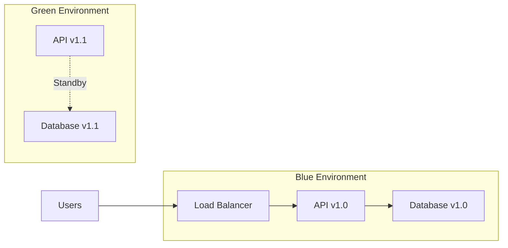
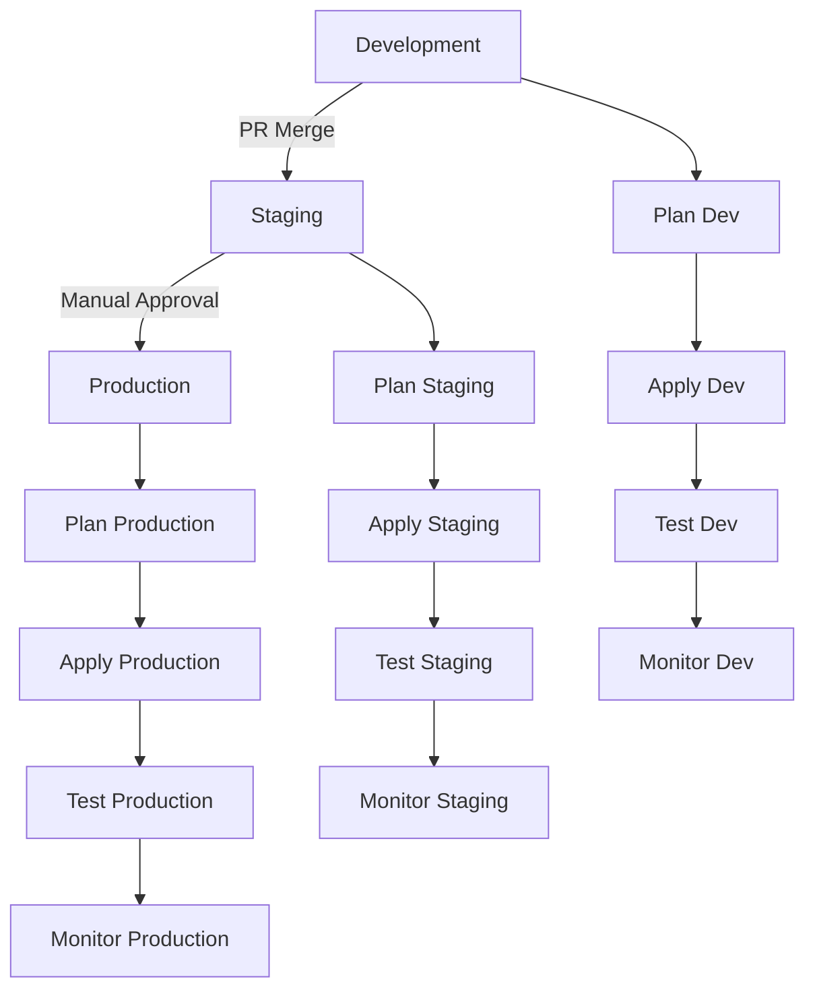

# BioPoint Infrastructure Deployment Procedures

## Deployment Strategy

### Blue-Green Deployment

BioPoint uses a blue-green deployment strategy for zero-downtime infrastructure updates:



### Deployment Pipeline



## Pre-Deployment Checklist

### Environment-Specific Checklist

#### Development Deployment
- [ ] Code review completed
- [ ] Tests passing in CI
- [ ] Terraform plan reviewed
- [ ] No breaking changes identified
- [ ] Cost impact acceptable

#### Staging Deployment
- [ ] Development deployment successful
- [ ] QA testing completed
- [ ] Performance tests passing
- [ ] Security scan clean
- [ ] Documentation updated
- [ ] Stakeholder approval received

#### Production Deployment
- [ ] Staging deployment successful (24h minimum)
- [ ] Change advisory board approval
- [ ] Rollback plan documented
- [ ] On-call team notified
- [ ] Customer communication prepared
- [ ] Compliance review completed

### General Pre-Deployment Steps

1. **Review Infrastructure Changes**
   ```bash
   cd infrastructure/terraform
   terraform plan -var-file=../environments/${ENVIRONMENT}.tfvars
   ```

2. **Security Scanning**
   ```bash
   # Run Checkov
   checkov -d . --framework terraform
   
   # Run tfsec
   tfsec . --format default
   ```

3. **Cost Estimation**
   ```bash
   # Generate cost estimate
   infracost breakdown --path tfplan-${ENVIRONMENT}
   ```

4. **Backup Verification**
   ```bash
   # Verify recent backups
   aws s3 ls s3://biopoint-backups-${ENVIRONMENT}/
   
   # Test database backup restoration
   # (In staging environment)
   ```

## Deployment Procedures

### 1. Development Environment Deployment

#### Automated Deployment (CI/CD)

```bash
# Triggered automatically on merge to develop branch
git checkout develop
git pull origin develop

# Terraform plan and apply
terraform plan -var-file=../environments/dev.tfvars
terraform apply -var-file=../environments/dev.tfvars -auto-approve
```

#### Manual Deployment

```bash
# 1. Navigate to infrastructure directory
cd biopoint/infrastructure

# 2. Set environment variables
export TF_VAR_environment=dev
export TF_VAR_cloudflare_api_token=$CLOUDFLARE_API_TOKEN
export TF_VAR_neon_api_key=$NEON_API_KEY
export TF_VAR_datadog_api_key=$DATADOG_API_KEY
export TF_VAR_datadog_app_key=$DATADOG_APP_KEY
export TF_VAR_doppler_service_token=$DOPPLER_SERVICE_TOKEN

# 3. Initialize Terraform
cd terraform
terraform init -backend=true
terraform workspace select dev || terraform workspace new dev

# 4. Plan infrastructure changes
terraform plan -var-file=../environments/dev.tfvars -out=tfplan-dev

# 5. Review plan output
# - Check for any destructive changes
# - Verify resource additions/modifications
# - Confirm cost impact

# 6. Apply changes
terraform apply tfplan-dev

# 7. Verify deployment
echo "Verifying development deployment..."
curl -f https://api.dev.biopoint.app/health || echo "API health check failed"
curl -f https://app.dev.biopoint.app/health || echo "App health check failed"
```

### 2. Staging Environment Deployment

#### Approval Process

1. **Create Deployment Request**
   ```bash
   # Create deployment ticket
   ./scripts/create-deployment-ticket.sh staging
   ```

2. **Stakeholder Review**
   - Technical lead review
   - QA team sign-off
   - Security team review
   - Product owner approval

3. **Schedule Deployment**
   - Coordinate with team availability
   - Schedule during low-traffic hours
   - Notify stakeholders

#### Deployment Steps

```bash
# 1. Pre-deployment checks
./scripts/pre-deployment-checks.sh staging

# 2. Backup current state
echo "Creating backup of current staging environment..."
./scripts/backup-environment.sh staging

# 3. Deploy infrastructure
cd infrastructure/terraform
terraform workspace select staging
terraform plan -var-file=../environments/staging.tfvars -out=tfplan-staging

# Manual approval step (in CI/CD)
echo "Staging deployment requires manual approval"
echo "Review the plan above and approve to continue"

# 4. Apply with approval
terraform apply tfplan-staging

# 5. Post-deployment validation
./scripts/post-deployment-validation.sh staging

# 6. Run smoke tests
./scripts/smoke-tests.sh staging

# 7. Performance tests
./scripts/performance-tests.sh staging
```

### 3. Production Environment Deployment

#### Pre-Production Checklist

- [ ] Change Advisory Board (CAB) approval
- [ ] Risk assessment completed
- [ ] Rollback plan tested
- [ ] On-call team availability confirmed
- [ ] Customer communication prepared
- [ ] Compliance review completed

#### Production Deployment Window

- **Preferred Window**: Tuesday-Thursday, 2-6 AM UTC
- **Maintenance Window**: Pre-scheduled with customers
- **Emergency Deployment**: Available 24/7 for critical fixes

#### Deployment Procedure

```bash
#!/bin/bash
# production-deploy.sh

set -e  # Exit on any error

ENVIRONMENT="production"
TIMESTAMP=$(date +%Y%m%d_%H%M%S)
LOG_FILE="/var/log/biopoint/deploy-${TIMESTAMP}.log"

echo "Starting production deployment at $(date)" | tee $LOG_FILE

# 1. Pre-deployment checklist
echo "Running pre-deployment checklist..." | tee -a $LOG_FILE
./scripts/pre-deployment-checklist.sh $ENVIRONMENT

# 2. Create deployment backup
echo "Creating deployment backup..." | tee -a $LOG_FILE
./scripts/create-deployment-backup.sh $ENVIRONMENT

# 3. Notify team
echo "Notifying deployment team..." | tee -a $LOG_FILE
./scripts/notify-deployment-start.sh $ENVIRONMENT

# 4. Enable maintenance mode (if required)
echo "Enabling maintenance mode..." | tee -a $LOG_FILE
./scripts/maintenance-mode.sh enable

# 5. Deploy infrastructure
echo "Deploying infrastructure..." | tee -a $LOG_FILE
cd infrastructure/terraform
terraform workspace select $ENVIRONMENT

# Create detailed plan
terraform plan -var-file=../environments/${ENVIRONMENT}.tfvars \
               -out=tfplan-${ENVIRONMENT}-${TIMESTAMP} \
               -detailed-exitcode

PLAN_EXIT_CODE=$?
if [ $PLAN_EXIT_CODE -eq 0 ]; then
    echo "No changes detected, deployment not needed" | tee -a $LOG_FILE
    exit 0
elif [ $PLAN_EXIT_CODE -eq 1 ]; then
    echo "Plan failed, check logs" | tee -a $LOG_FILE
    exit 1
fi

# Apply with detailed logging
terraform apply tfplan-${ENVIRONMENT}-${TIMESTAMP} | tee -a $LOG_FILE

# 6. Disable maintenance mode
echo "Disabling maintenance mode..." | tee -a $LOG_FILE
./scripts/maintenance-mode.sh disable

# 7. Post-deployment validation
echo "Running post-deployment validation..." | tee -a $LOG_FILE
./scripts/post-deployment-validation.sh $ENVIRONMENT

# 8. Health checks
echo "Running health checks..." | tee -a $LOG_FILE
./scripts/health-checks.sh $ENVIRONMENT

# 9. Performance monitoring
echo "Starting performance monitoring..." | tee -a $LOG_FILE
./scripts/monitor-performance.sh $ENVIRONMENT &

# 10. Notify completion
echo "Notifying deployment completion..." | tee -a $LOG_FILE
./scripts/notify-deployment-complete.sh $ENVIRONMENT

echo "Production deployment completed successfully at $(date)" | tee -a $LOG_FILE
```

## Rollback Procedures

### Automated Rollback Triggers

- Health check failures > 5 minutes
- Error rate > 10% for > 10 minutes
- Response time > 5s for > 15 minutes
- Database connectivity issues
- Critical security alerts

### Manual Rollback Process

```bash
#!/bin/bash
# rollback-production.sh

ENVIRONMENT=$1
ROLLBACK_POINT=$2

echo "Starting rollback for $ENVIRONMENT to $ROLLBACK_POINT"

# 1. Enable maintenance mode
./scripts/maintenance-mode.sh enable

# 2. Restore from backup
./scripts/restore-from-backup.sh $ENVIRONMENT $ROLLBACK_POINT

# 3. Verify restoration
./scripts/verify-restoration.sh $ENVIRONMENT

# 4. Update DNS if needed
./scripts/update-dns.sh $ENVIRONMENT "rollback"

# 5. Disable maintenance mode
./scripts/maintenance-mode.sh disable

# 6. Validate rollback
./scripts/validate-rollback.sh $ENVIRONMENT

echo "Rollback completed successfully"
```

### Rollback Validation

1. **Health Checks**
   ```bash
   # API health
   curl -f https://api.biopoint.app/health
   
   # Application health
   curl -f https://app.biopoint.app/health
   
   # Database connectivity
   psql $DATABASE_URL -c "SELECT 1"
   ```

2. **Performance Validation**
   ```bash
   # Response time check
   curl -w "@curl-format.txt" -o /dev/null -s https://api.biopoint.app/health
   
   # Load test (light)
   ./scripts/light-load-test.sh
   ```

3. **Data Integrity Check**
   ```bash
   # Verify database integrity
   ./scripts/check-database-integrity.sh
   
   # Verify storage accessibility
   ./scripts/check-storage-access.sh
   ```

## Post-Deployment Activities

### 1. Immediate Validation (0-30 minutes)

- [ ] All health checks passing
- [ ] No critical alerts
- [ ] Response times within SLA
- [ ] Database connections stable
- [ ] Storage access verified

### 2. Short-term Monitoring (30 minutes - 4 hours)

- [ ] Error rates stable
- [ ] Performance metrics normal
- [ ] User activity patterns normal
- [ ] No security alerts
- [ ] Cost impact as expected

### 3. Long-term Monitoring (4-24 hours)

- [ ] 24-hour performance trending
- [ ] User feedback analysis
- [ ] Cost analysis completed
- [ ] Security scan results
- [ ] Compliance verification

### 4. Documentation Updates

- [ ] Update deployment logs
- [ ] Update infrastructure documentation
- [ ] Update runbooks
- [ ] Update monitoring dashboards
- [ ] Update team knowledge base

## Emergency Procedures

### Critical Incident Response

1. **Immediate Actions (0-5 minutes)**
   - Assess incident severity
   - Notify on-call team
   - Enable maintenance mode if needed
   - Begin incident documentation

2. **Short-term Response (5-30 minutes)**
   - Implement temporary fixes
   - Escalate if necessary
   - Communicate with stakeholders
   - Monitor system status

3. **Long-term Resolution (30+ minutes)**
   - Root cause analysis
   - Permanent fix implementation
   - Comprehensive testing
   - Post-incident review

### Communication Templates

#### Internal Team Notification
```
Subject: [DEPLOYMENT] BioPoint Infrastructure Update - ${ENVIRONMENT}

Team,

Infrastructure deployment for ${ENVIRONMENT} environment has been initiated.

Deployment Details:
- Environment: ${ENVIRONMENT}
- Start Time: ${START_TIME}
- Expected Duration: ${DURATION}
- Changes: ${CHANGE_SUMMARY}

Monitoring:
- Dashboard: ${DASHBOARD_URL}
- Health Checks: ${HEALTH_CHECK_URL}

Contact:
- On-call: ${ON_CALL_CONTACT}
- Deployment Lead: ${DEPLOYMENT_LEAD}

Updates will be provided as the deployment progresses.

Regards,
BioPoint Infrastructure Team
```

#### Customer Communication
```
Subject: [MAINTENANCE] BioPoint Service Update

Dear BioPoint Users,

We will be performing scheduled maintenance to improve our services.

Maintenance Window:
- Start: ${START_TIME}
- End: ${END_TIME}
- Duration: ${DURATION}
- Services Affected: ${AFFECTED_SERVICES}

What to Expect:
- Brief service interruption
- Improved performance and security
- New features and enhancements

Thank you for your patience.

Best regards,
BioPoint Team
```

## Deployment Metrics and KPIs

### Key Performance Indicators

| Metric | Target | Measurement |
|--------|--------|-------------|
| Deployment Frequency | Weekly | Number of deployments per week |
| Lead Time | < 2 hours | Time from code merge to production |
| Deployment Duration | < 30 minutes | Time to complete deployment |
| Change Failure Rate | < 5% | Percentage of deployments causing incidents |
| Mean Time to Recovery | < 1 hour | Time to recover from deployment failure |

### Automated Metrics Collection

```bash
# Deployment frequency
git log --since="1 week ago" --oneline --grep="deploy" | wc -l

# Deployment duration
echo "$(date -d $END_TIME +%s) - $(date -d $START_TIME +%s)" | bc

# Change failure rate
echo "scale=2; $FAILED_DEPLOYMENTS / $TOTAL_DEPLOYMENTS * 100" | bc

# Mean time to recovery
echo "scale=2; $TOTAL_RECOVERY_TIME / $INCIDENT_COUNT" | bc
```

## Continuous Improvement

### Post-Deployment Reviews

1. **Weekly Team Reviews**
   - Deployment success rate
   - Incident analysis
   - Process improvements
   - Tool effectiveness

2. **Monthly Stakeholder Reviews**
   - Business impact assessment
   - Cost analysis
   - Risk evaluation
   - Strategic alignment

3. **Quarterly Strategic Reviews**
   - Architecture evolution
   - Technology updates
   - Compliance assessment
   - Long-term planning

### Process Optimization

1. **Automation Opportunities**
   - Manual task identification
   - Automation feasibility study
   - Implementation planning
   - ROI measurement

2. **Tool Evaluation**
   - Current tool assessment
   - Alternative tool research
   - Proof of concept testing
   - Migration planning

3. **Training and Development**
   - Team skill assessment
   - Training needs analysis
   - Certification programs
   - Knowledge sharing sessions

This comprehensive deployment procedure ensures reliable, secure, and efficient infrastructure deployments for BioPoint's healthcare platform while maintaining HIPAA compliance and operational excellence.