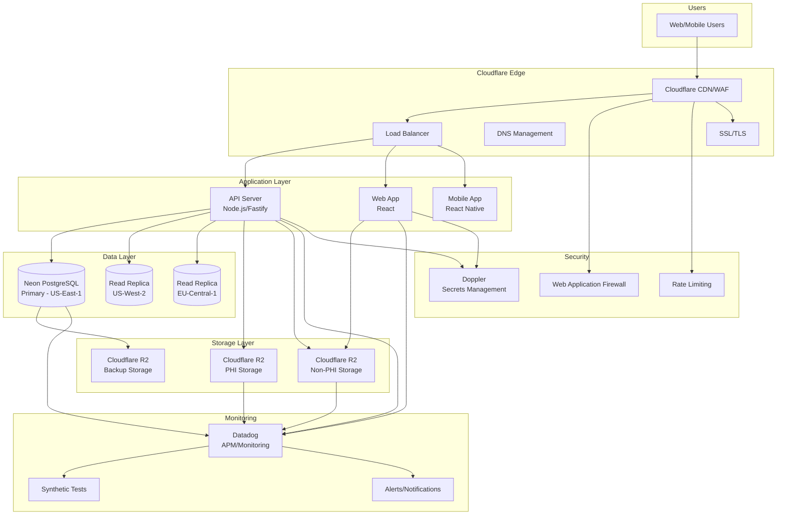
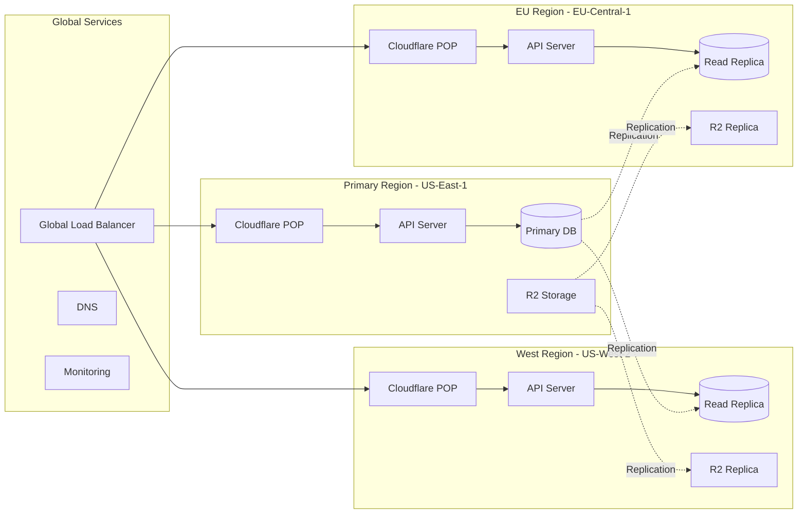
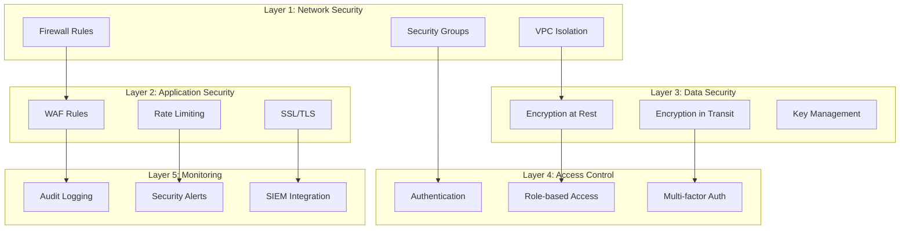

# BioPoint Infrastructure Overview

## Architecture Diagram



## Multi-Region Architecture



## Component Details

### 1. Cloudflare Edge Services

**Purpose**: Global CDN, security, and performance optimization

**Key Features**:
- **CDN**: Content delivery with 300+ global POPs
- **WAF**: Web Application Firewall with OWASP Top 10 protection
- **DDoS Protection**: Layer 3-7 DDoS mitigation
- **Rate Limiting**: Request throttling per IP
- **SSL/TLS**: Automatic certificate management with HSTS
- **Load Balancing**: Global load balancing with health checks

**Configuration**:
```hcl
# Rate limiting: 100 requests/minute per IP
# WAF: Custom rules + managed rulesets
# SSL: TLS 1.3 with HSTS
# Caching: 24h for static assets, 5min for API
```

### 2. Application Servers

**Purpose**: Handle API requests and serve web applications

**Architecture**:
- **Auto-scaling**: Based on CPU/memory utilization
- **Health checks**: HTTP health endpoints
- **Blue-green deployment**: Zero-downtime deployments
- **Container orchestration**: Docker + orchestration platform

**Technology Stack**:
- **API**: Node.js + Fastify + TypeScript
- **Web App**: React + Next.js + TypeScript
- **Mobile**: React Native + TypeScript

### 3. Database Infrastructure

**Purpose**: Store application data with HIPAA compliance

**Neon PostgreSQL Features**:
- **Serverless**: Auto-scaling compute and storage
- **Branching**: Database branches for development/testing
- **Point-in-time recovery**: Restore to any point in time
- **Read replicas**: Multi-region read scaling
- **Connection pooling**: Built-in connection pooling

**Database Schema**:
```sql
-- Core tables with HIPAA compliance
CREATE TABLE users (
    id UUID PRIMARY KEY,
    email VARCHAR(255) UNIQUE NOT NULL,
    encrypted_pii TEXT, -- Encrypted PII data
    created_at TIMESTAMP DEFAULT NOW(),
    updated_at TIMESTAMP DEFAULT NOW()
);

CREATE TABLE health_data (
    id UUID PRIMARY KEY,
    user_id UUID REFERENCES users(id),
    encrypted_data TEXT NOT NULL, -- Always encrypted
    data_type VARCHAR(50) NOT NULL,
    created_at TIMESTAMP DEFAULT NOW()
);
```

### 4. Storage Infrastructure

**Purpose**: Store files, images, and backups with HIPAA compliance

**Cloudflare R2 Features**:
- **S3-compatible API**: Standard S3 API compatibility
- **No egress fees**: Cost-effective data transfer
- **Global replication**: Multi-region storage
- **Lifecycle policies**: Automated data lifecycle management
- **Encryption**: Server-side encryption at rest

**Storage Classification**:
```yaml
PHI Storage:
  - Retention: 7 years (HIPAA requirement)
  - Encryption: Required
  - Access: Restricted
  - Backup: Cross-region replication
  - Examples: Lab results, medical images, health records

Non-PHI Storage:
  - Retention: 1 year
  - Encryption: Recommended
  - Access: Application-level
  - Backup: Regional replication
  - Examples: User avatars, app assets, logs
```

### 5. Monitoring and Observability

**Purpose**: Comprehensive monitoring, alerting, and observability

**Datadog Features**:
- **Infrastructure monitoring**: CPU, memory, disk, network
- **Application performance monitoring (APM)**: Request tracing, profiling
- **Synthetic monitoring**: Uptime monitoring from multiple locations
- **Log management**: Centralized log collection and analysis
- **Security monitoring**: Threat detection and compliance monitoring

**Key Metrics**:
```yaml
SLI/SLO Targets:
  - Availability: 99.9% (SLO: 99.5%)
  - Response Time: p95 < 1s (SLO: p95 < 2s)
  - Error Rate: < 1% (SLO: < 5%)
  - Database Performance: Query time < 100ms
```

### 6. Secrets Management

**Purpose**: Secure storage and management of sensitive configuration

**Doppler Features**:
- **Environment-specific configs**: Separate configs per environment
- **Secret rotation**: Automated secret rotation
- **Audit logging**: Complete audit trail
- **Access controls**: Role-based access control
- **Integration**: Native integration with deployment pipelines

**Secret Categories**:
```yaml
Database Secrets:
  - DATABASE_URL
  - DATABASE_READ_REPLICA_URL

API Secrets:
  - JWT_SECRET
  - API_SECRET
  - SESSION_SECRET

Storage Secrets:
  - STORAGE_ACCESS_KEY_ID
  - STORAGE_SECRET_ACCESS_KEY

Third-party Integration:
  - DATADOG_API_KEY
  - CLOUDFLARE_API_TOKEN
  - SMTP_CREDENTIALS
```

## Security Architecture

### Defense in Depth



### HIPAA Compliance Features

1. **Data Encryption**
   - AES-256 encryption at rest
   - TLS 1.3 encryption in transit
   - Key rotation every 90 days

2. **Access Controls**
   - Role-based access control (RBAC)
   - Multi-factor authentication (MFA)
   - Session management and timeout

3. **Audit Logging**
   - Complete audit trail of all access
   - Data modification tracking
   - Failed authentication attempts

4. **Data Integrity**
   - Checksums for data validation
   - Version control for data changes
   - Backup integrity verification

5. **Business Associate Agreements**
   - Signed BAAs with all service providers
   - Regular compliance reviews
   - Incident response procedures

## Performance Characteristics

### Scalability

- **Horizontal scaling**: Auto-scaling based on load
- **Database scaling**: Read replicas for query scaling
- **Storage scaling**: Unlimited object storage
- **Global scaling**: Multi-region deployment

### Performance Targets

```yaml
Response Times:
  - API: < 200ms (p95)
  - Database: < 100ms (p95)
  - Static Assets: < 50ms (CDN cached)

Throughput:
  - API: 10,000 requests/second
  - Database: 1,000 queries/second
  - Storage: 1GB/second transfer

Availability:
  - Target: 99.9%
  - Downtime: < 43 minutes/month
  - Recovery Time: < 1 hour
```

### Performance Optimization

1. **Caching Strategy**
   - CDN caching for static assets
   - Database query caching
   - Application-level caching
   - API response caching

2. **Database Optimization**
   - Connection pooling
   - Query optimization
   - Index optimization
   - Read replica utilization

3. **Network Optimization**
   - HTTP/2 and HTTP/3
   - Compression (Brotli, Gzip)
   - Keep-alive connections
   - Prefetching and preloading

## Disaster Recovery

### Recovery Objectives

```yaml
Recovery Time Objective (RTO):
  - Database Failure: < 1 hour
  - Application Failure: < 30 minutes
  - Complete Region Failure: < 4 hours

Recovery Point Objective (RPO):
  - Database: < 15 minutes
  - Application: < 5 minutes
  - Storage: < 1 hour
```

### Disaster Recovery Procedures

1. **Database Recovery**
   - Automatic failover to read replicas
   - Point-in-time recovery from backups
   - Cross-region backup restoration

2. **Application Recovery**
   - Blue-green deployment rollback
   - Container orchestration recovery
   - Load balancer health check failover

3. **Storage Recovery**
   - Cross-region replication failover
   - Backup restoration from R2
   - Version recovery for objects

## Compliance and Governance

### Regulatory Compliance

- **HIPAA**: Healthcare data protection
- **SOC 2**: Security and availability
- **GDPR**: Data privacy (EU users)
- **CCPA**: California privacy laws

### Governance Framework

```yaml
Change Management:
  - Infrastructure as Code (IaC)
  - Version control with Git
  - Peer review process
  - Automated testing

Access Governance:
  - Role-based access control
  - Regular access reviews
  - Privileged access management
  - Audit trail maintenance

Risk Management:
  - Regular risk assessments
  - Vulnerability management
  - Incident response plan
  - Business continuity planning
```

## Cost Structure

### Monthly Cost Estimates (Production)

```yaml
Cloudflare Services:
  - CDN/Security: $200-500/month
  - R2 Storage: $50-100/month (based on usage)
  - Load Balancing: $50/month

Neon Database:
  - Business Plan: $500-1000/month
  - Read Replicas: $200-400/month
  - Backup Storage: $50-100/month

Datadog Monitoring:
  - Infrastructure Monitoring: $200-400/month
  - APM: $300-600/month
  - Synthetic Tests: $100-200/month

AWS Services:
  - S3 Backend: $10-20/month
  - DynamoDB Locks: $5-10/month

Doppler Secrets:
  - Team Plan: $50-100/month

Total Estimated Cost:
  - Development: $200-400/month
  - Staging: $500-800/month
  - Production: $1500-2500/month
```

### Cost Optimization Strategies

1. **Development Environment**
   - Enable auto-pause for databases
   - Use smaller instance sizes
   - Reduce backup frequency
   - Disable non-essential monitoring

2. **Staging Environment**
   - Use moderate instance sizes
   - Enable cost-effective features
   - Maintain essential monitoring
   - Optimize backup retention

3. **Production Environment**
   - Focus on performance over cost
   - Maintain full monitoring
   - Implement comprehensive backups
   - Ensure high availability

This infrastructure architecture provides a robust, scalable, and secure foundation for BioPoint's healthcare platform while maintaining HIPAA compliance and cost-effectiveness.