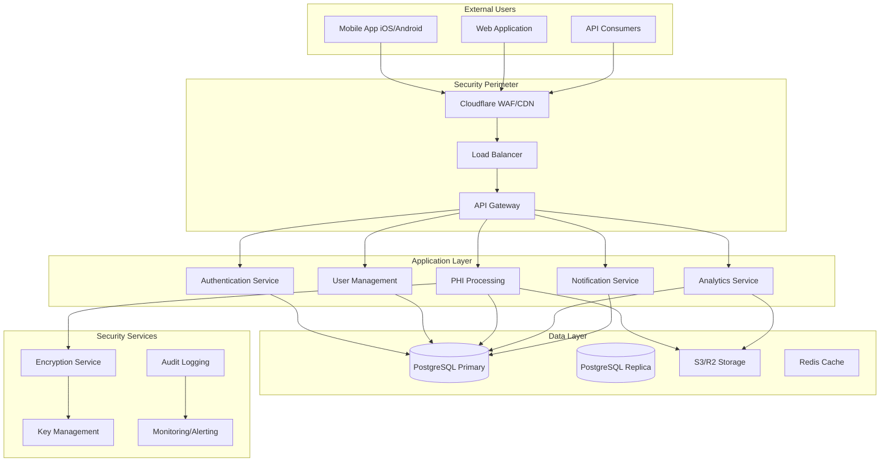
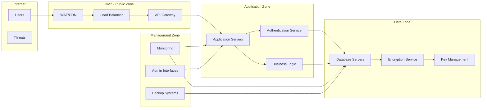
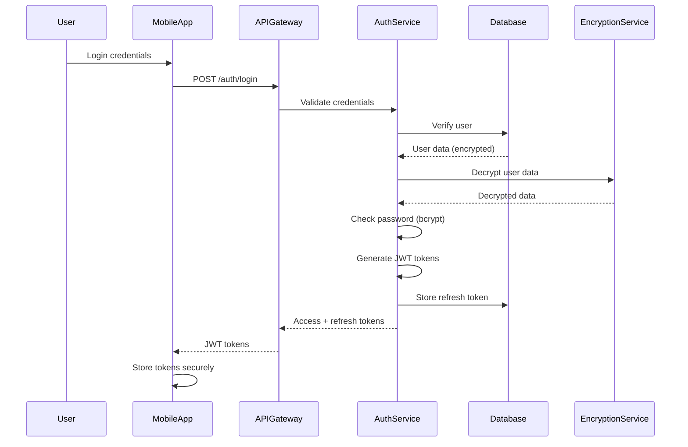
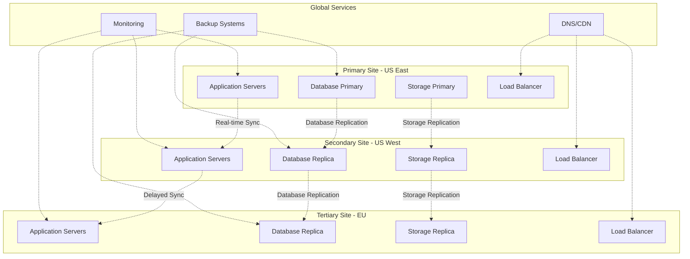

# BioPoint Security Architecture Documentation

**Document Classification:** CONFIDENTIAL  
**Version:** 1.0  
**Date:** January 20, 2026  
**Prepared By:** Security Architecture Team  
**Approved By:** Chief Information Security Officer  

## Executive Summary

This document provides comprehensive documentation of BioPoint's security architecture, designed to protect Protected Health Information (PHI) and ensure compliance with HIPAA, GDPR, and industry security standards. The architecture implements a defense-in-depth strategy with multiple security layers across infrastructure, application, data, and network components.

**Architecture Principles:**
- Defense in depth with layered security controls
- Zero-trust network architecture
- Encryption by default for all sensitive data
- Comprehensive audit logging and monitoring
- Automated security response and remediation
- Compliance-first design approach

**Key Components:**
- Multi-region cloud infrastructure with redundancy
- Field-level encryption for PHI data
- Microservices architecture with API security
- Identity and access management with MFA
- Real-time security monitoring and alerting
- Automated backup and disaster recovery

## 1. System Overview and Architecture

### 1.1 High-Level Architecture



### 1.2 Component Description

**External Interface Layer:**
- **Cloudflare WAF/CDN:** Provides DDoS protection, web application firewall, and content delivery
- **Load Balancer:** Distributes traffic across multiple application instances with health checking
- **API Gateway:** Centralized API management, rate limiting, and authentication enforcement

**Application Services Layer:**
- **Authentication Service:** JWT-based authentication with refresh token rotation and MFA support
- **User Management:** Role-based access control (RBAC) and user profile management
- **PHI Processing:** Core business logic for health data processing with field-level encryption
- **Analytics Service:** Data analysis and reporting with de-identification capabilities
- **Notification Service:** Email and push notifications with secure message delivery

**Data Storage Layer:**
- **PostgreSQL Primary:** Main database with high availability and automated backups
- **PostgreSQL Replica:** Read replicas for performance and disaster recovery
- **S3/R2 Storage:** Encrypted object storage for files and documents
- **Redis Cache:** Session management and temporary data caching

**Security Services Layer:**
- **Encryption Service:** Field-level encryption for PHI with automated key rotation
- **Audit Logging:** Comprehensive security event logging with tamper protection
- **Key Management:** Secure key storage and rotation using hardware security modules
- **Monitoring/Alerting:** Real-time security monitoring with automated incident response

## 2. Network Architecture

### 2.1 Multi-Region Deployment

**Geographic Distribution:**
```yaml
Primary_Region: "US_East_1"
  Availability_Zones: ["us-east-1a", "us-east-1b", "us-east-1c"]
  Services: ["Primary_application", "Primary_database", "Primary_storage"]
  Capacity: "70%_of_total_traffic"
  
Secondary_Region: "US_West_2"
  Availability_Zones: ["us-west-2a", "us-west-2b", "us-west-2c"]
  Services: ["Secondary_application", "Database_replica", "Storage_replica"]
  Capacity: "30%_of_total_traffic"
  
Tertiary_Regions:
  - "EU_Central_1": "European_user_base"
  - "AP_Southeast_1": "Asia_Pacific_user_base"
  
Failover_Capabilities:
  Automatic: "Health_check_based_failover"
  Recovery_Time: "< 5_minutes"
  Data_Sync: "Real_time_replication"
  DNS_Switching: "Geographic_load_balancing"
```

### 2.2 Network Segmentation

**Network Architecture with Security Zones:**


**Security Zone Configuration:**
```yaml
Public_Zone_DMZ:
  Components: ["WAF", "CDN", "Load_Balancer", "API_Gateway"]
  Access: "Internet_accessible"
  Security_Controls:
    - "DDoS_protection"
    - "Web_application_firewall"
    - "Rate_limiting"
    - "SSL/TLS_termination"
    - "Basic_authentication"
  Network_ACL: "Restrictive_inbound_allow_443_80_only"
  Monitoring: "Enhanced_logging_and_monitoring"

Application_Zone:
  Components: ["Application_Servers", "Microservices", "Authentication_Service"]
  Access: "DMZ_access_only"
  Security_Controls:
    - "Application_layer_firewall"
    - "JWT_authentication_validation"
    - "Input_validation_and_sanitization"
    - "API_rate_limiting"
    - "Service_to_service_authentication"
  Network_ACL: "DMZ_to_application_specific_ports_only"
  Monitoring: "Application_performance_and_security_monitoring"

Data_Zone:
  Components: ["Database_Servers", "Encryption_Services", "Key_Management"]
  Access: "Application_zone_only"
  Security_Controls:
    - "Database_encryption_at_rest"
    - "Field_level_encryption"
    - "Database_activity_monitoring"
    - "Key_management_with_HSM"
    - "Encrypted_backup_storage"
  Network_ACL: "Application_zone_to_database_ports_only"
  Monitoring: "Database_security_and_performance_monitoring"

Management_Zone:
  Components: ["Monitoring", "Backup_Systems", "Admin_Interfaces"]
  Access: "VPN_access_only"
  Security_Controls:
    - "Multi_factor_authentication"
    - "Privileged_access_management"
    - "Session_monitoring_and_recording"
    - "Administrative_action_logging"
    - "Jump_server_access"
  Network_ACL: "VPN_specific_admin_ports_only"
  Monitoring: "Privileged_activity_monitoring"
```

### 2.3 Network Security Controls

**Firewall Rules and Access Control:**
```bash
# Public Zone (DMZ) Firewall Rules
# Allow HTTPS traffic from internet
iptables -A INPUT -p tcp --dport 443 -j ACCEPT
iptables -A INPUT -p tcp --dport 80 -j ACCEPT

# Block all other inbound traffic
iptables -A INPUT -j DROP

# Allow established connections
iptables -A INPUT -m state --state ESTABLISHED,RELATED -j ACCEPT

# Application Zone Firewall Rules
# Allow traffic from DMZ on specific ports
iptables -A INPUT -s DMZ_SUBNET -p tcp --dport 8080 -j ACCEPT
iptables -A INPUT -s DMZ_SUBNET -p tcp --dport 8443 -j ACCEPT

# Block direct internet access
iptables -A INPUT -s 0.0.0.0/0 -j DROP

# Data Zone Firewall Rules
# Allow traffic from application zone only
iptables -A INPUT -s APP_SUBNET -p tcp --dport 5432 -j ACCEPT  # PostgreSQL
iptables -A INPUT -s APP_SUBNET -p tcp --dport 6379 -j ACCEPT  # Redis

# Management Zone Firewall Rules
# Allow traffic from VPN network only
iptables -A INPUT -s VPN_SUBNET -p tcp --dport 22 -j ACCEPT    # SSH
iptables -A INPUT -s VPN_SUBNET -p tcp --dport 3389 -j ACCEPT # RDP
```

**Intrusion Detection and Prevention:**
```typescript
const networkSecurityMonitoring = {
  idsIps: {
    provider: 'Cloudflare Magic Firewall',
    deployment: 'Distributed_across_all_regions',
    rules: 'Custom_and_threat_intelligence_based',
    response: 'Automated_blocking_and_alerting'
  },
  
  networkTrafficAnalysis: {
    tool: 'Zeek Network Security Monitor',
    deployment: 'Network_taps_at_critical_points',
    analysis: 'Real_time_and_historical_analysis',
    integration: 'SIEM_and_SOAR_integration'
  },
  
  anomalyDetection: {
    method: 'Machine_learning_based_anomaly_detection',
    baseline: 'Continuously_updated_traffic_patterns',
    alerting: 'Automated_security_team_notification',
    threshold: 'Dynamic_threshold_adjustment'
  }
};
```

## 3. Encryption Architecture

### 3.1 Data Encryption Strategy

**Encryption Implementation Matrix:**
```yaml
Data_Categories:
  Protected_Health_Information_PHI:
    Encryption_at_Rest: "AES-256-GCM_field_level_encryption"
    Encryption_in_Transit: "TLS_1.3_with_AES-256-GCM"
    Key_Management: "HSM_with_annual_key_rotation"
    Access_Controls: "Role_based_with_audit_logging"
    Backup_Encryption: "AES-256_with_separate_backup_keys"
    
  Personally_Identifiable_Information_PII:
    Encryption_at_Rest: "AES-256_database_encryption"
    Encryption_in_Transit: "TLS_1.3_minimum"
    Key_Management: "Centralized_key_management"
    Access_Controls: "Need_to_access_principle"
    Backup_Encryption: "AES-256_with_backup_encryption"
    
  Authentication_Data:
    Encryption_at_Rest: "bcrypt_with_cost_factor_12"
    Encryption_in_Transit: "TLS_1.3_with_certificate_pinning"
    Key_Management: "Dedicated_authentication_key_store"
    Access_Controls: "Multi_factor_authentication_required"
    Backup_Encryption: "Encrypted_with_authentication_keys"
    
  System_Data:
    Encryption_at_Rest: "AES-256_full_disk_encryption"
    Encryption_in_Transit: "TLS_1.2_minimum"
    Key_Management: "Platform_managed_keys"
    Access_Controls: "System_administrator_access_only"
    Backup_Encryption: "Platform_managed_backup_encryption"
```

### 3.2 Field-Level Encryption Implementation

**Encryption Service Architecture:**
```typescript
interface EncryptionService {
  // Encryption methods
  encryptField(data: any, fieldType: string): EncryptedData;
  decryptField(encryptedData: EncryptedData, fieldType: string): any;
  
  // Key management
  rotateKeys(rotationPolicy: KeyRotationPolicy): Promise<void>;
  getCurrentKeyVersion(): number;
  getKeyMetadata(keyId: string): KeyMetadata;
  
  // Audit and compliance
  getEncryptionAuditLog(): AuditLogEntry[];
  validateEncryptionIntegrity(): IntegrityReport;
}

class FieldLevelEncryption implements EncryptionService {
  private encryptionAlgorithm = 'aes-256-gcm';
  private keyDerivationFunction = 'pbkdf2';
  private authenticationTagLength = 128;
  
  encryptField(data: any, fieldType: string): EncryptedData {
    // Generate unique IV for each encryption operation
    const iv = crypto.randomBytes(16);
    
    // Derive field-specific encryption key
    const fieldKey = this.deriveFieldKey(fieldType);
    
    // Create cipher
    const cipher = crypto.createCipher(this.encryptionAlgorithm, fieldKey);
    cipher.setAAD(Buffer.from(fieldType));
    
    // Encrypt data
    let encrypted = cipher.update(JSON.stringify(data), 'utf8', 'base64');
    encrypted += cipher.final('base64');
    
    // Get authentication tag
    const authTag = cipher.getAuthTag();
    
    return {
      encryptedData: encrypted,
      iv: iv.toString('base64'),
      authTag: authTag.toString('base64'),
      algorithm: this.encryptionAlgorithm,
      keyVersion: this.getCurrentKeyVersion(),
      timestamp: new Date().toISOString()
    };
  }
  
  decryptField(encryptedData: EncryptedData, fieldType: string): any {
    // Validate encryption metadata
    this.validateEncryptionMetadata(encryptedData);
    
    // Derive field-specific decryption key
    const fieldKey = this.deriveFieldKey(fieldType, encryptedData.keyVersion);
    
    // Create decipher
    const decipher = crypto.createDecipher(this.encryptionAlgorithm, fieldKey);
    decipher.setAAD(Buffer.from(fieldType));
    decipher.setAuthTag(Buffer.from(encryptedData.authTag, 'base64'));
    
    // Decrypt data
    let decrypted = decipher.update(encryptedData.encryptedData, 'base64', 'utf8');
    decrypted += decipher.final('utf8');
    
    return JSON.parse(decrypted);
  }
}
```

**Database Schema with Encryption:**
```sql
-- Profile table with encrypted PHI fields
CREATE TABLE profiles (
    id UUID PRIMARY KEY DEFAULT gen_random_uuid(),
    user_id UUID REFERENCES users(id) NOT NULL,
    
    -- Encrypted PHI fields
    date_of_birth_encrypted JSONB,
    medical_history_encrypted JSONB,
    emergency_contact_encrypted JSONB,
    
    -- Non-encrypted fields
    height_cm INTEGER,
    weight_kg DECIMAL(5,2),
    created_at TIMESTAMP DEFAULT CURRENT_TIMESTAMP,
    updated_at TIMESTAMP DEFAULT CURRENT_TIMESTAMP,
    
    -- Encryption metadata
    encryption_version INTEGER DEFAULT 1,
    last_key_rotation TIMESTAMP DEFAULT CURRENT_TIMESTAMP
);

-- Lab reports table with encrypted values
CREATE TABLE lab_reports (
    id UUID PRIMARY KEY DEFAULT gen_random_uuid(),
    user_id UUID REFERENCES users(id) NOT NULL,
    report_type VARCHAR(100) NOT NULL,
    
    -- Encrypted content
    lab_values_encrypted JSONB,
    notes_encrypted JSONB,
    diagnosis_encrypted JSONB,
    
    -- File references
    file_url_encrypted TEXT,
    file_metadata_encrypted JSONB,
    
    -- Audit fields
    created_at TIMESTAMP DEFAULT CURRENT_TIMESTAMP,
    encryption_version INTEGER DEFAULT 1
);
```

### 3.3 Key Management Architecture

**Hierarchical Key Management System:**
```yaml
Key_Hierarchy:
  Level_1_Master_Key:
    Type: "AES-256"
    Storage: "Hardware_Security_Module_HSM"
    Access: "Split_knowledge_2_of_3"
    Rotation: "Annual_or_on_compromise"
    Purpose: "Encrypt_data_encryption_keys"
    
  Level_2_Data_Encryption_Keys:
    Type: "AES-256"
    Storage: "Encrypted_with_master_key"
    Access: "Automated_system_access_only"
    Rotation: "Annual_or_on_compromise"
    Purpose: "Encrypt_PHI_data_fields"
    
  Level_3_Field_Encryption_Keys:
    Type: "AES-256"
    Storage: "Encrypted_with_DEK"
    Access: "Application_service_access"
    Rotation: "Quarterly_or_on_compromise"
    Purpose: "Encrypt_specific_data_fields"
    
  Level_4_Transport_Keys:
    Type: "RSA-4096"
    Storage: "HSM_with_certificate_management"
    Access: "TLS_termination_only"
    Rotation: "Annual_with_certificate_renewal"
    Purpose: "TLS_encryption_in_transit"
```

**Key Rotation Process:**
```typescript
const keyRotationProcess = {
  automaticRotation: {
    frequency: 'Annual_for_all_keys',
    trigger: 'Scheduled_maintenance_window',
    notification: '30_days_advance_notice',
    validation: 'Automated_rotation_verification'
  },
  
  emergencyRotation: {
    trigger: 'Key_compromise_or_security_incident',
    timeLimit: '4_hours',
    approval: 'CISO_approval_required',
    communication: 'Immediate_stakeholder_notification'
  },
  
  rotationProcedure: {
    step1: 'Generate_new_key_in_HSM',
    step2: 'Re_encrypt_data_with_new_key',
    step3: 'Update_application_key_references',
    step4: 'Securely_destroy_old_key',
    step5: 'Validate_encryption_functionality',
    step6: 'Update_audit_logs_and_documentation'
  }
};
```

## 4. Authentication and Authorization Architecture

### 4.1 Authentication Flow

**JWT-Based Authentication Architecture:**


**Token Structure and Security:**
```typescript
interface JWTTokens {
  accessToken: {
    header: {
      alg: 'RS256',
      typ: 'JWT',
      kid: 'key_identifier'
    },
    payload: {
      sub: 'user_id',
      iss: 'biopoint.com',
      aud: 'biopoint-api',
      exp: 'expiration_time',
      iat: 'issued_at_time',
      jti: 'unique_token_id',
      scope: ['user:read', 'profile:write'],
      role: 'patient',
      clearance: 2,
      sessionId: 'session_identifier'
    }
  },
  
  refreshToken: {
    token: 'encrypted_refresh_token',
    expiresIn: '7_days',
    secureStorage: 'HttpOnly_Secure_SameSite_cookies',
    rotation: 'enabled_with_each_use'
  }
}
```

### 4.2 Authorization Architecture

**Role-Based Access Control (RBAC) Implementation:**
```typescript
interface AuthorizationService {
  checkPermission(user: User, resource: string, action: string): Promise<boolean>;
  getUserRoles(userId: string): Promise<Role[]>;
  getRolePermissions(roleId: string): Promise<Permission[]>;
  auditAccess(user: User, resource: string, action: string, result: boolean): Promise<void>;
}

class RBACAuthorization implements AuthorizationService {
  private roleHierarchy = {
    'system_admin': { level: 5, inherits: [] },
    'healthcare_provider': { level: 4, inherits: ['patient'] },
    'researcher': { level: 3, inherits: [] },
    'patient': { level: 2, inherits: [] },
    'support_staff': { level: 1, inherits: [] }
  };
  
  async checkPermission(user: User, resource: string, action: string): Promise<boolean> {
    // Get user roles
    const userRoles = await this.getUserRoles(user.id);
    
    // Check each role for permission
    for (const role of userRoles) {
      const hasPermission = await this.checkRolePermission(role, resource, action);
      if (hasPermission) {
        await this.auditAccess(user, resource, action, true);
        return true;
      }
    }
    
    await this.auditAccess(user, resource, action, false);
    return false;
  }
  
  private async checkRolePermission(role: Role, resource: string, action: string): Promise<boolean> {
    // Check direct permissions
    const directPermissions = await this.getRolePermissions(role.id);
    const hasDirectPermission = directPermissions.some(perm => 
      perm.resource === resource && perm.action === action
    );
    
    if (hasDirectPermission) return true;
    
    // Check inherited permissions
    const inheritedRoles = this.getInheritedRoles(role.name);
    for (const inheritedRole of inheritedRoles) {
      const inheritedPermissions = await this.getRolePermissions(inheritedRole.id);
      const hasInheritedPermission = inheritedPermissions.some(perm =>
        perm.resource === resource && perm.action === action
      );
      if (hasInheritedPermission) return true;
    }
    
    return false;
  }
}
```

**ABAC (Attribute-Based Access Control) for PHI:**
```typescript
const phiAccessControl = {
  requiredAttributes: {
    user: ['role', 'clearanceLevel', 'certifications', 'department'],
    resource: ['dataType', 'sensitivity', 'patientId'],
    environment: ['timeOfDay', 'location', 'network'],
    action: ['type', 'purpose']
  },
  
  policies: [
    {
      name: 'Healthcare Provider PHI Access',
      conditions: {
        'user.role': 'healthcare_provider',
        'user.clearanceLevel': '>=3',
        'user.certifications': 'contains:HIPAA_trained',
        'resource.dataType': 'PHI',
        'environment.timeOfDay': '07:00-19:00',
        'action.purpose': 'treatment'
      },
      decision: 'permit',
      obligations: ['audit.log_access', 'verify.consent']
    },
    {
      name: 'Patient Self-Access',
      conditions: {
        'user.role': 'patient',
        'user.id': '==resource.patientId',
        'action.type': ['read', 'write']
      },
      decision: 'permit',
      obligations: ['audit.log_access']
    }
  ]
};
```

## 5. Security Monitoring Architecture

### 5.1 Security Information and Event Management (SIEM)

**Centralized Security Monitoring Platform:**
```typescript
const siemConfiguration = {
  platform: 'Datadog Security Platform',
  deployment: 'Multi_region_with_federation',
  dataSources: [
    'Application_logs',
    'System_logs',
    'Network_logs',
    'Database_logs',
    'Cloud_provider_logs',
    'Security_tool_logs'
  ],
  
  correlation: {
    realTime: 'Stream_processing_with_complex_event_processing',
    historical: 'Batch_analysis_for_pattern_detection',
    behavioral: 'Machine_learning_based_anomaly_detection',
    threatIntelligence: 'External_feed_correlation'
  },
  
  alerting: {
    severityLevels: ['Critical', 'High', 'Medium', 'Low'],
    notificationChannels: ['Email', 'SMS', 'Slack', 'PagerDuty'],
    escalation: 'Automated_escalation_based_on_severity',
    suppression: 'Intelligent_alert_suppression_to_reduce_noise'
  }
};
```

**Security Event Correlation Rules:**
```yaml
Rule_001_PHI_Access_Anomaly:
  Description: "Detect_unusual_PHI_access_patterns"
  Conditions:
    - "Multiple_PHI_accesses_from_single_IP"
    - "PHI_access_outside_business_hours"
    - "PHI_access_from_new_location"
    - "Bulk_PHI_export_or_download"
  Actions:
    - "Increase_monitoring_level"
    - "Notify_security_team"
    - "Require_additional_authentication"
    - "Generate_incident_ticket"
  
Rule_002_Authentication_Attack:
  Description: "Detect_brute_force_authentication_attacks"
  Conditions:
    - "5_failed_login_attempts_in_15_minutes"
    - "Login_attempts_from_multiple_locations"
    - "Login_attempts_against_multiple_accounts"
    - "Unusual_authentication_methods_or_patterns"
  Actions:
    - "Block_source_IP_address"
    - "Suspend_target_accounts"
    - "Notify_security_team_and_user"
    - "Generate_security_alert"
    
Rule_003_Data_Exfiltration:
  Description: "Detect_potential_data_exfiltration_activities"
  Conditions:
    - "Large_data_downloads_or_exports"
    - "Unusual_API_usage_patterns"
    - "Access_to_unusual_data_combinations"
    - "Data_access_during_non_business_hours"
  Actions:
    - "Block_data_transfer"
    - "Require_additional_authorization"
    - "Notify_security_team_immediately"
    - "Preserve_forensic_evidence"
```

### 5.2 Automated Incident Response

**Security Orchestration and Automated Response (SOAR):**
```typescript
const automatedIncidentResponse = {
  platform: 'Custom_SOAR_Platform',
  capabilities: {
    incidentEnrichment: 'Automated_data_collection_and_analysis',
    containment: 'Automated_threat_containment_actions',
    evidenceCollection: 'Automated_forensic_evidence_preservation',
    communication: 'Automated_stakeholder_notification'
  },
  
  playbooks: {
    credentialCompromise: {
      detection: 'Suspicious_login_activity',
      actions: [
        'Block_source_IP',
        'Suspend_compromised_accounts',
        'Force_password_reset',
        'Enable_additional_MFA',
        'Collect_forensic_logs'
      ],
      escalation: 'Security_team_notification'
    },
    
    dataBreach: {
      detection: 'Unauthorized_PHI_access',
      actions: [
        'Block_data_access',
        'Preserve_system_state',
        'Collect_audit_logs',
        'Notify_legal_and_compliance',
        'Initiate_incident_response'
      ],
      escalation: 'Immediate_executive_notification'
    },
    
    malwareDetection: {
      detection: 'Malware_signature_or_behavior',
      actions: [
        'Isolate_affected_systems',
        'Block_malicious_IPs',
        'Update_security_signatures',
        'Scan_related_systems',
        'Collect_malware_samples'
      ],
      escalation: 'Security_team_notification'
    }
  }
};
```

## 6. Backup and Disaster Recovery Architecture

### 6.1 Backup Strategy

**Multi-Tier Backup Architecture:**
```yaml
Backup_Strategy:
  Database_Backups:
    Frequency: "Continuous_replication_with_point_in_time_recovery"
    Retention: "30_days_with_12_monthly_archives"
    Encryption: "AES-256_with_separate_backup_keys"
    Storage: "Multi_region_S3_with_lifecycle_policies"
    Testing: "Weekly_restore_testing"
    
  Application_Data_Backups:
    Frequency: "Daily_incremental_with_weekly_full"
    Retention: "90_days_with_annual_archives"
    Encryption: "AES-256_with_application_specific_keys"
    Storage: "S3_with_cross_region_replication"
    Testing: "Monthly_restore_testing"
    
  Configuration_Backups:
    Frequency: "Daily_with_change_based_triggers"
    Retention: "1_year_with_version_history"
    Encryption: "AES-256_with_configuration_keys"
    Storage: "Git_repositories_with_encrypted_secrets"
    Testing: "Configuration_validation_testing"
    
  Key_Material_Backups:
    Frequency: "After_key_rotation_events"
    Retention: "7_years_for_compliance"
    Encryption: "HSM_with_key_escrow"
    Storage: "Offline_HSM_with_legal_hold"
    Testing: "Annual_key_recovery_exercise"
```

**Backup Encryption and Security:**
```typescript
const backupSecurity = {
  encryption: {
    algorithm: 'AES-256-GCM',
    keyManagement: 'Separate_backup_encryption_keys',
    keyRotation: 'Annual_key_rotation',
    keyStorage: 'HSM_with_access_controls'
  },
  
  accessControl: {
    authentication: 'Multi_factor_authentication_required',
    authorization: 'Role_based_access_to_backup_systems',
    audit: 'Comprehensive_backup_access_logging',
    segregation: 'Separate_backup_administrator_accounts'
  },
  
  integrity: {
    checksums: 'SHA-256_checksums_for_all_backups',
    validation: 'Automated_integrity_verification',
    tamperDetection: 'Real_time_tamper_detection',
    chainOfCustody: 'Complete_backup_lifecycle_audit_trail'
  }
};
```

### 6.2 Disaster Recovery Architecture

**Multi-Site Disaster Recovery Setup:**


**Disaster Recovery Procedures:**
```typescript
const disasterRecoveryProcedures = {
  siteFailover: {
    detection: 'Automated_health_check_failure_detection',
    decision: 'Manual_approval_for_site_failover',
    execution: 'Automated_failover_with_manual_oversight',
    rto: 'Recovery_Time_Objective_<_4_hours',
    rpo: 'Recovery_Point_Objective_<_1_hour'
  },
  
  dataRecovery: {
    databaseRecovery: 'Point_in_time_recovery_with_transaction_logs',
    applicationRecovery: 'Container_orchestration_with_automated_deployment',
    storageRecovery: 'Cross_region_storage_replication_and_recovery',
    configurationRecovery: 'Infrastructure_as_code_with_version_control'
  },
  
  testing: {
    frequency: 'Quarterly_full_disaster_recovery_testing',
    scope: 'Complete_application_and_data_recovery',
    validation: 'Business_function_validation_post_recovery',
    documentation: 'Detailed_test_results_and_improvement_recommendations'
  }
};
```

## 7. Compliance and Audit Architecture

### 7.1 Compliance Monitoring

**Automated Compliance Validation:**
```typescript
const complianceMonitoring = {
  hipaa: {
    encryptionValidation: 'Daily_PHI_encryption_verification',
    accessControlAudit: 'Weekly_access_control_review',
    auditLogCompleteness: 'Continuous_audit_log_monitoring',
    breachDetection: 'Real_time_breach_detection_and_notification'
  },
  
  soc2: {
    controlEffectiveness: 'Monthly_control_testing',
    incidentResponse: 'Quarterly_incident_response_drills',
    changeManagement: 'Automated_change_control_validation',
    vendorManagement: 'Annual_vendor_security_assessments'
  },
  
  gdpr: {
    dataSubjectRights: 'Automated_rights_management_validation',
    consentManagement: 'Continuous_consent_tracking',
    dataMinimization: 'Automated_data_retention_enforcement',
    breachNotification: '72_hour_breach_notification_capability'
  }
};
```

### 7.2 Audit Trail Architecture

**Comprehensive Audit Logging System:**
```yaml
Audit_Architecture:
  Log_Collection:
    Sources: ["Application_logs", "System_logs", "Network_logs", "Database_logs", "Security_tool_logs"]
    Method: "Centralized_collection_with_agent_based_shipping"
    Frequency: "Real_time_with_buffering"
    Encryption: "TLS_1.3_encryption_in_transit"
    
  Log_Storage:
    Primary: "Time_series_database_with_compression"
    Backup: "Immutable_storage_with_WORM_capability"
    Retention: "7_years_for_HIPAA_compliance"
    Indexing: "Multi_field_indexing_for_fast_search"
    
  Log_Analysis:
    Real_Time: "Stream_processing_for_security_events"
    Batch: "Daily_batch_analysis_for_compliance"
    Correlation: "Cross_system_event_correlation"
    Alerting: "Automated_alerting_for_anomalies"
    
  Audit_Reporting:
    Scheduled: "Daily_weekly_monthly_scheduled_reports"
    Ad_Hoc: "On_demand_compliance_and_investigation_reports"
    Export: "Secure_export_in_multiple_formats"
    Access: "Role_based_access_to_audit_data"
```

## Conclusion

BioPoint's security architecture provides a comprehensive, multi-layered approach to protecting Protected Health Information while ensuring high availability and performance. The architecture implements industry best practices and regulatory requirements through:

**Key Strengths:**
- Multi-region deployment with automatic failover
- Field-level encryption for all PHI data
- Comprehensive monitoring and alerting
- Automated incident response capabilities
- Regular backup and disaster recovery testing
- Continuous compliance monitoring

**Compliance Achievement:**
- HIPAA technical, administrative, and physical safeguards
- GDPR data protection requirements
- SOC 2 Type II control framework
- Industry best practices and standards

**Next Evolution Steps:**
1. Implementation of zero-trust network architecture
2. Advanced AI-driven threat detection
3. Quantum-resistant encryption preparation
4. Enhanced supply chain security
5. Continuous security posture optimization

The documented architecture provides a solid foundation for secure health data processing with the flexibility to adapt to evolving security threats and regulatory requirements.

---

**Document Prepared By:** Security Architecture Team  
**Review Date:** January 20, 2026  
**Next Review:** April 20, 2026  
**Distribution:** Security Team, Architecture Board, Executive Team