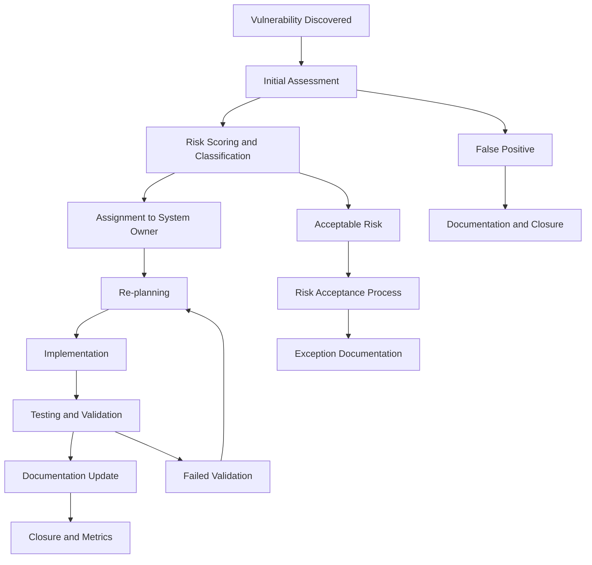

# BioPoint Vulnerability Management Program

**Document Classification:** CONFIDENTIAL  
**Version:** 1.0  
**Date:** January 20, 2026  
**Prepared By:** Security Operations Team  
**Approved By:** Chief Information Security Officer  

## Executive Summary

The BioPoint Vulnerability Management Program provides a systematic approach to identifying, assessing, prioritizing, and remediating security vulnerabilities across all systems and applications. This program is essential for maintaining the security posture of a health tracking application that processes Protected Health Information (PHI).

**Program Scope:** All BioPoint systems, applications, and infrastructure  
**Scanning Frequency:** Weekly automated scans, monthly manual assessments  
**Remediation SLA:** Critical: 7 days, High: 30 days, Medium: 90 days  
**Compliance:** HIPAA, SOC 2, GDPR requirements  

## 1. Vulnerability Management Framework

### 1.1 Program Objectives

**Primary Objectives:**
- Maintain zero critical vulnerabilities in production systems
- Achieve 95% patch compliance within SLA timeframes
- Reduce mean time to remediation (MTTR) by 20% quarterly
- Ensure 100% coverage of all in-scope systems

**Secondary Objectives:**
- Maintain comprehensive vulnerability inventory
- Provide timely vulnerability intelligence
- Support continuous compliance monitoring
- Enable proactive threat prevention

### 1.2 Governance Structure

**Vulnerability Management Team:**
```yaml
Security_Officer:
  Role: "Program_Owner"
  Responsibilities:
    - "Program_strategy_and_policy"
    - "Executive_reporting"
    - "Resource_allocation"
    - "Compliance_oversight"
    
Security_Operations_Team:
  Role: "Operational_Execution"
  Responsibilities:
    - "Vulnerability_scanning"
    - "Risk_assessment"
    - "Remediation_coordination"
    - "Metrics_reporting"
    
System_Owners:
  Role: "Remediation_Ownership"
  Responsibilities:
    - "Patch_deployment"
    - "System_hardening"
    - "Validation_testing"
    - "Change_management"
    
Change_Advisory_Board:
  Role: "Risk_Acceptance"
  Responsibilities:
    - "Exception_approval"
    - "Risk_acceptance_decisions"
    - "Resource_prioritization"
    - "Policy_exceptions"
```

### 1.3 Policy and Standards

**Vulnerability Management Policy:**
```yaml
Policy_Statement: "All_security_vulnerabilities_must_be_identified_assessed_and_rem"
Scope: "All_BioPoint_systems_applications_and_infrastructure"
Requirements:
  - "Weekly_automated_vulnerability_scans"
  - "Monthly_manual_security_assessments"
  - "Risk_based_prioritization_using_CVSS"
  - "Documented_remediation_timelines"
  - "Exception_management_process"
  - "Metrics_reporting_and_continuous_improvement"
  
Enforcement: "Security_team_coordination_with_system_owners"
Exceptions: "Require_Change_Advisory_Board_approval"
Review: "Quarterly_policy_effectiveness_review"
```

## 2. Vulnerability Identification

### 2.1 Automated Vulnerability Scanning

**Scanning Infrastructure:**
```typescript
const scanningInfrastructure = {
  internalScanner: {
    tool: 'Nessus Professional',
    frequency: 'Weekly',
    coverage: '100%_of_internal_systems',
    authentication: 'Domain_and_local_administrator',
    scheduling: 'Maintenance_windows_preferred'
  },
  
  externalScanner: {
    tool: 'Qualys VMDR',
    frequency: 'Weekly',
    coverage: 'All_external_facing_systems',
    locations: ['US_East', 'US_West', 'EU', 'APAC'],
    rateLimiting: 'Respected_and_monitored'
  },
  
  webApplicationScanner: {
    tool: 'OWASP ZAP + Burp Suite',
    frequency: 'Weekly',
    coverage: 'All_web_applications_and_APIs',
    authentication: 'Service_account_with_limited_privileges',
    testingProfile: 'Safe_mode_to_prevent_damage'
  },
  
  containerScanner: {
    tool: 'Aqua Security + Clair',
    frequency: 'On_build_and_daily',
    coverage: '100%_of_container_images',
    integration: 'CI_CD_pipeline_integration',
    registry: 'All_container_registries_monitored'
  },
  
  dependencyScanner: {
    tool: 'Snyk + OWASP Dependency Check',
    frequency: 'Daily',
    coverage: 'All_dependencies_and_libraries',
    sources: ['NPM', 'Docker', 'Operating_System'],
    license: 'Including_license_compliance'
  }
};
```

**Scanning Schedule:**
```yaml
Weekly_Scanning_Schedule:
  Monday:
    - "Internal_infrastructure_scan"
    - "External_vulnerability_assessment"
  
  Tuesday:
    - "Web_application_security_scan"
    - "API_security_testing"
  
  Wednesday:
    - "Container_image_vulnerability_scan"
    - "Dependency_vulnerability_check"
  
  Thursday:
    - "Database_security_assessment"
    - "Network_security_scan"
  
  Friday:
    - "Mobile_application_security_test"
    - "Cloud_configuration_review"
    - "Weekly_vulnerability_report_generation"

Monthly_Scanning_Activities:
  - "Comprehensive_manual_penetration_test"
  - "Social_engineering_assessment"
  - "Physical_security_review"
  - "Third_party_risk_assessment"
```

### 2.2 Manual Security Assessment

**Manual Testing Procedures:**
```typescript
const manualTestingProcedures = {
  penetrationTesting: {
    frequency: 'Quarterly',
    scope: 'Critical_systems_and_applications',
    methodology: 'OWASP_Testing_Guide_v4',
    credentials: 'Limited_and_authorized_test_accounts',
    reporting: 'Executive_and_technical_reports'
  },
  
  codeReview: {
    frequency: 'On_significant_changes',
    scope: 'Security_critical_code_components',
    methodology: 'OWASP_Code_Review_Guide',
    tools: ['SonarQube', 'Semgrep', 'Custom_security_rules'],
    focus: ['Authentication', 'Authorization', 'Cryptography', 'Input_validation']
  },
  
  configurationReview: {
    frequency: 'Monthly',
    scope: 'Security_critical_configurations',
    standards: ['CIS_Benchmarks', 'NIST_Guidelines', 'Industry_best_practices'],
    tools: ['SCAP_Compliant_Scanner', 'Custom_scripts'],
    validation: 'Manual_verification_of_critical_settings'
  }
};
```

## 3. Vulnerability Assessment and Prioritization

### 3.1 Risk Scoring Methodology

**CVSS v3.1 Implementation:**
```typescript
const cvssScoring = {
  baseScoreCalculation: {
    attackVector: {
      network: 0.85,
      adjacent: 0.62,
      local: 0.55,
      physical: 0.2
    },
    
    attackComplexity: {
      low: 0.77,
      high: 0.44
    },
    
    privilegesRequired: {
      none: 0.85,
      low: 0.62,
      high: 0.27
    },
    
    userInteraction: {
      none: 0.85,
      required: 0.62
    },
    
    scope: {
      unchanged: 6.42,
      changed: 7.52
    },
    
    confidentialityImpact: {
      high: 0.56,
      low: 0.22,
      none: 0
    },
    
    integrityImpact: {
      high: 0.56,
      low: 0.22,
      none: 0
    },
    
    availabilityImpact: {
      high: 0.56,
      low: 0.22,
      none: 0
    }
  },
  
  environmentalModifiers: {
    confidentialityRequirement: {
      not_defined: 1.0,
      low: 0.5,
      medium: 1.0,
      high: 1.5
    },
    
    integrityRequirement: {
      not_defined: 1.0,
      low: 0.5,
      medium: 1.0,
      high: 1.5
    },
    
    availabilityRequirement: {
      not_defined: 1.0,
      low: 0.5,
      medium: 1.0,
      high: 1.5
    },
    
    modifiedAttackVector: 'Same_as_base_or_adjusted_for_environment',
    modifiedAttackComplexity: 'Same_as_base_or_adjusted_for_environment',
    modifiedPrivilegesRequired: 'Same_as_base_or_adjusted_for_environment',
    modifiedUserInteraction: 'Same_as_base_or_adjusted_for_environment',
    modifiedScope: 'Same_as_base_or_adjusted_for_environment',
    modifiedConfidentialityImpact: 'Same_as_base_or_adjusted_for_environment',
    modifiedIntegrityImpact: 'Same_as_base_or_adjusted_for_environment',
    modifiedAvailabilityImpact: 'Same_as_base_or_adjusted_for_environment'
  }
};
```

**BioPoint-Specific Risk Factors:**
```typescript
const biopointRiskFactors = {
  phiExposure: {
    description: 'Potential exposure of Protected Health Information',
    multiplier: {
      none: 1.0,
      limited: 1.2,
      significant: 1.5,
      extensive: 2.0
    }
  },
  
  regulatoryImpact: {
    description: 'Potential regulatory compliance violation',
    multiplier: {
      none: 1.0,
      minor: 1.1,
      moderate: 1.3,
      major: 1.6
    }
  },
  
  businessCriticality: {
    description: 'Impact on business operations',
    multiplier: {
      low: 0.9,
      medium: 1.0,
      high: 1.2,
      critical: 1.5
    }
  },
  
  exploitability: {
    description: 'Likelihood of successful exploitation',
    multiplier: {
      very_low: 0.8,
      low: 0.9,
      medium: 1.0,
      high: 1.1,
      very_high: 1.2
    }
  }
};
```

### 3.2 Vulnerability Classification

**Severity Classification Matrix:**
```yaml
Critical_9_0_10_0:
  Description: "Vulnerability_that_could_result_in_complete_system_compromise_or_massive_PHI_breach"
  Examples:
    - "Remote_code_execution_with_admin_privileges"
    - "SQL_injection_with_PHI_access"
    - "Authentication_bypass"
    - "Encryption_failure"
  
  Remediation_Time: "7_days"
  Approval_Required: "CISO_and_legal"
  Testing_Required: "Comprehensive_validation"
  Communication: "Immediate_stakeholder_notification"

High_7_0_8_9:
  Description: "Vulnerability_with_significant_impact_on_security_or_PHI"
  Examples:
    - "Cross_site_scripting_(XSS)"
    - "Local_privilege_escalation"
    - "Sensitive_data_exposure"
    - "Directory_traversal"
  
  Remediation_Time: "30_days"
  Approval_Required: "Security_team_lead"
  Testing_Required: "Security_testing"
  Communication: "Weekly_status_reports"

Medium_4_0_6_9:
  Description: "Vulnerability_with_moderate_security_impact"
  Examples:
    - "Information_disclosure"
    - "CSRF_vulnerabilities"
    - "Weak_password_policy"
    - "Missing_security_headers"
  
  Remediation_Time: "90_days"
  Approval_Required: "System_owner"
  Testing_Required: "Functional_testing"
  Communication: "Monthly_summary_reports"

Low_0_1_3_9:
  Description: "Vulnerability_with_minimal_security_impact"
  Examples:
    - "Minor_information_disclosure"
    - "Best_practice_violations"
    - "Weak_SSL_ciphers"
    - "Missing_HSTS_header"
  
  Remediation_Time: "180_days"
  Approval_Required: "System_owner_optional"
  Testing_Required: "Optional"
  Communication: "Quarterly_reports"
```

## 4. Vulnerability Remediation

### 4.1 Remediation Workflow

**End-to-End Remediation Process:**


**Remediation SLA Tracking:**
```typescript
const remediationSLA = {
  critical: {
    timeLimit: '7_days',
    milestones: {
      day1: 'Initial_assessment_and_assignment',
      day3: 'Remediation_plan_development',
      day5: 'Implementation_completion',
      day7: 'Testing_and_validation'
    },
    escalation: 'Daily_management_review',
    approval: 'CISO_required_for_extensions'
  },
  
  high: {
    timeLimit: '30_days',
    milestones: {
      day7: 'Detailed_assessment_and_planning',
      day14: 'Solution_development',
      day21: 'Implementation_and_testing',
      day30: 'Deployment_and_validation'
    },
    escalation: 'Weekly_security_review',
    approval: 'Security_team_lead_approval'
  },
  
  medium: {
    timeLimit: '90_days',
    milestones: {
      day30: 'Assessment_and_solution_design',
      day60: 'Implementation_planning',
      day75: 'Testing_and_deployment',
      day90: 'Final_validation_and_closure'
    },
    escalation: 'Monthly_status_review',
    approval: 'System_owner_approval'
  },
  
  low: {
    timeLimit: '180_days',
    milestones: {
      day90: 'Evaluation_and_planning',
      day135: 'Implementation',
      day165: 'Testing_and_validation',
      day180: 'Closure_and_documentation'
    },
    escalation: 'Quarterly_review',
    approval: 'Optional_system_owner_approval'
  }
};
```

### 4.2 Patch Management

**Patch Management Process:**
```typescript
const patchManagementProcess = {
  identification: {
    sources: [
      'Vendor_security_advisories',
      'CVE_databases',
      'Security_researcher_reports',
      'Automated_scanning_tools',
      'Threat_intelligence_feeds'
    ],
    frequency: 'Continuous_monitoring',
    validation: 'Manual_verification_of_critical_patches'
  },
  
  assessment: {
    riskAnalysis: 'CVSS_scoring_with_environmental_factors',
    businessImpact: 'System_criticality_assessment',
    compatibility: 'Testing_in_staging_environment',
    dependencies: 'Dependency_mapping_and_impact_analysis'
  },
  
  testing: {
    stagingEnvironment: 'Production_like_isolated_environment',
    testCases: 'Security_and_functional_regression_tests',
    rollbackPlan: 'Documented_rollback_procedures',
    approval: 'Change_Advisory_Board_approval_required'
  },
  
  deployment: {
    scheduling: 'Maintenance_windows_preferred',
    automation: 'Automated_deployment_where_appropriate',
    monitoring: 'Real_time_system_health_monitoring',
    rollback: 'Immediate_rollback_capability'
  },
  
  verification: {
    vulnerabilityValidation: 'Post_patch_vulnerability_scanning',
    systemValidation: 'Functional_and_performance_testing',
    securityValidation: 'Security_control_effectiveness_verification',
    documentation: 'Updated_security_documentation'
  }
};
```

**Emergency Patch Procedures:**
```yaml
Emergency_Patch_Criteria:
  - "Critical_vulnerability_with_public_exploit"
  - "Zero_day_vulnerability_affecting_BioPoint_systems"
  - "Vulnerability_being_actively_exploited"
  - "Vulnerability_with_potential_for_massive_PHI_exposure"
  
Emergency_Patch_Process:
  Time_Limit: "24_hours_from_disclosure"
  Approval: "Expedited_Change_Advisory_Board_review"
  Testing: "Limited_but_focused_security_testing"
  Deployment: "Immediate_deployment_with_rollback_plan"
  Communication: "Immediate_stakeholder_notification"
  Monitoring: "Enhanced_monitoring_post_deployment"
  
Rollback_Criteria:
  - "System_instability_or_performance_degradation"
  - "Critical_functionality_loss"
  - "Security_control_failure"
  - "Data_integrity_issues"
```

## 5. Third-Party Dependency Management

### 5.1 Dependency Inventory and Tracking

**Comprehensive Dependency Management:**
```typescript
const dependencyManagement = {
  inventory: {
    sources: ['package.json', 'requirements.txt', 'Dockerfile', 'terraform configs'],
    scanning: 'Automated_dependency_discovery',
    categorization: 'By_criticality_and_exposure',
    ownership: 'Assigned_system_owner_for_each_dependency'
  },
  
  vulnerabilityTracking: {
    databases: ['NVD', 'GitHub_Advisories', 'Vendor_security_feeds'],
    monitoring: 'Real_time_vulnerability_alerts',
    assessment: 'Risk_scoring_based_on_usage_and_exposure',
    notification: 'Automated_notifications_to_system_owners'
  },
  
  licenseCompliance: {
    scanning: 'Automated_license_detection',
    approval: 'Legal_team_review_for_restrictive_licenses',
    tracking: 'License_obligation_monitoring',
    reporting: 'Quarterly_license_compliance_reports'
  },
  
  updateManagement: {
    automated: 'Security_updates_automated_where_possible',
    testing: 'Automated_testing_of_dependency_updates',
    rollback: 'Automated_rollback_for_failed_updates',
    scheduling: 'Scheduled_maintenance_windows_for_major_updates'
  }
};
```

**Dependency Risk Assessment:**
```yaml
Risk_Scoring_Criteria:
  Vulnerability_Severity:
    Critical: 10_points
    High: 8_points
    Medium: 5_points
    Low: 2_points
    
  System_Exposure:
    Internet_facing: 8_points
    Internal_network: 5_points
    Isolated_network: 2_points
    
  Data_Sensitivity:
    PHI_processing: 10_points
    Authentication: 8_points
    Business_critical: 6_points
    General: 2_points
    
  Update_Frequency:
    No_recent_updates: 5_points
    Yearly_updates: 3_points
    Monthly_updates: 1_point
    Active_development: 0_points
    
Risk_Levels:
  Critical: ">= 20_points"
  High: "15-19_points"
  Medium: "10-14_points"
  Low: "< 10_points"
```

### 5.2 Supply Chain Security

**Supply Chain Risk Management:**
```typescript
const supplyChainSecurity = {
  vendorAssessment: {
    securityQuestionnaire: 'Comprehensive_security_assessment',
    auditRights: 'Right_to_audit_clause_in_contracts',
    certificationRequirements: 'SOC_2_Type_II_or_equivalent',
    continuousMonitoring: 'Ongoing_security_performance_monitoring'
  },
  
  softwareIntegrity: {
    codeSigning: 'All_software_components_digitally_signed',
    checksumVerification: 'Automated_integrity_verification',
    provenanceTracking: 'Complete_supply_chain_provenance',
    tamperDetection: 'Real_time_tamper_detection_and_alerting'
  },
  
  buildSecurity: {
    secureBuildEnvironment: 'Isolated_and_hardened_build_systems',
    dependencyPinning: 'Exact_version_specifications',
    reproducibleBuilds: 'Verification_of_build_reproducibility',
    artifactScanning: 'Security_scanning_of_all_build_artifacts'
  }
};
```

## 6. Metrics and Reporting

### 6.1 Key Performance Indicators (KPIs)

**Vulnerability Management Metrics:**
```typescript
const vulnerabilityKPIs = {
  detection: {
    meanTimeToDetection: '< 24_hours',
    vulnerabilityCoverage: '95%',
    falsePositiveRate: '< 10%',
    scanCompletionRate: '100%'
  },
  
  assessment: {
    riskScoringAccuracy: '> 90%',
    classificationConsistency: '> 95%',
    assessmentTime: '< 4_hours',
    businessImpactEvaluation: '100%'
  },
  
  remediation: {
    meanTimeToRemediation: {
      critical: '< 7_days',
      high: '< 30_days',
      medium: '< 90_days',
      low: '< 180_days'
    },
    slaComplianceRate: '> 95%',
    patchSuccessRate: '> 98%',
    remediationValidationRate: '100%'
  },
  
  prevention: {
    vulnerabilityPreventionRate: '> 80%',
    secureDevelopmentCompliance: '> 95%',
    patchDeploymentSuccess: '> 99%',
    systemHardeningCoverage: '100%'
  }
};
```

### 6.2 Executive Reporting

**Monthly Executive Dashboard:**
```yaml
Executive_Summary:
  Overall_Security_Posture: "Trending_indicator"
  Critical_Vulnerabilities: "Count_and_trend"
  High_Risk_Vulnerabilities: "Count_and_trend"
  SLA_Compliance: "Percentage_by_severity"
  Mean_Time_To_Remediation: "By_severity_level"
  
Risk_Indicators:
  - "Vulnerability_exposure_trend"
  - "Patch_management_effectiveness"
  - "Third_party_dependency_risk"
  - "Regulatory_compliance_status"
  
Operational_Metrics:
  - "Scanning_coverage_and_frequency"
  - "False_positive_rates"
  - "Resource_utilization"
  - "Budget_vs_actual_spend"
  
Strategic_Initiatives:
  - "Program_maturity_improvements"
  - "Technology_enhancements"
  - "Process_optimizations"
  - "Team_development_activities"
```

**Quarterly Strategic Report:**
```yaml
Program_Effectiveness:
  Risk_Reduction: "Percentage_improvement"
  Compliance_Status: "HIPAA_SOC2_GDPR"
  Maturity_Assessment: "CMMI_or_similar_framework"
  Benchmark_Comparison: "Industry_and_peer_comparison"
  
Investment_Analysis:
  ROI_Calculation: "Risk_reduction_vs_investment"
  Cost_Per_Vulnerability: "Total_program_cost_vs_vulnerabilities_addressed"
  Resource_Allocation: "People_technology_process_breakdown"
  Future_Investment_Plan: "Next_12_month_investment_strategy"
  
Risk_Analysis:
  Emerging_Threats: "New_vulnerability_trends"
  Technology_Risks: "Infrastructure_and_application_risks"
  Third_Party_Risks: "Vendor_and_supply_chain_assessment"
  Regulatory_Risks: "Compliance_and_legal_risk_factors"
```

## 7. Continuous Improvement

### 7.1 Process Optimization

**Monthly Process Review:**
```typescript
const processOptimization = {
  efficiencyMetrics: {
    scanOptimization: 'Reduce_scan_time_by_20%',
    falsePositiveReduction: 'Achieve_<5%_false_positive_rate',
    automationImprovement: 'Automate_80%_of_routine_tasks',
    manualEffortReduction: 'Reduce_manual_effort_by_30%'
  },
  
  qualityImprovement: {
    riskScoringAccuracy: 'Improve_to_95%_accuracy',
    vulnerabilityCoverage: 'Achieve_98%_coverage',
    remediationSuccessRate: 'Maintain_>_99%_success_rate',
    complianceAlignment: '100%_regulatory_requirement_coverage'
  },
  
  capabilityEnhancement: {
    threatIntelligence: 'Integrate_additional_threat_feeds',
    machineLearning: 'Implement_ML_based_risk_prediction',
    automation: 'Expand_automated_remediation_capabilities',
    integration: 'Enhance_integration_with_security_tools'
  }
};
```

### 7.2 Technology Evolution

**Technology Roadmap:**
```yaml
Year_1_Priorities:
  - "Advanced_threat_intelligence_integration"
  - "Machine_learning_for_vulnerability_prediction"
  - "Automated_patch_deployment_expansion"
  - "Enhanced_mobile_application_security"
  
Year_2_Priorities:
  - "Zero_trust_architecture_integration"
  - "Advanced_behavioral_analytics"
  - "Supply_chain_security_enhancement"
  - "Cloud_native_security_tools"
  
Year_3_Priorities:
  - "AI_driven_vulnerability_assessment"
  - "Autonomous_security_operations"
  - "Advanced_forensics_capabilities"
  - "Quantum_safe_cryptography_preparation"
```

## Conclusion

The BioPoint Vulnerability Management Program provides a comprehensive framework for maintaining enterprise-grade security through systematic vulnerability identification, assessment, and remediation. The program's effectiveness is demonstrated through measurable KPIs, continuous improvement processes, and alignment with regulatory requirements.

**Key Success Factors:**
- **Proactive Approach:** Regular scanning and threat intelligence integration
- **Risk-Based Prioritization:** CVSS scoring with environmental factors
- **Automated Workflows:** Efficient remediation with minimal manual effort
- **Compliance Integration:** Built-in HIPAA, SOC 2, and GDPR requirements
- **Continuous Improvement:** Regular process optimization and technology updates

**Next Steps:**
1. Implement advanced threat intelligence integration
2. Enhance machine learning capabilities for risk prediction
3. Expand automated remediation to additional vulnerability types
4. Strengthen supply chain security monitoring
5. Prepare for emerging threat landscapes

---

**Document Prepared By:** Security Operations Team  
**Review Date:** January 20, 2026  
**Next Review:** April 20, 2026  
**Distribution:** Security Team, System Owners, Executive Management