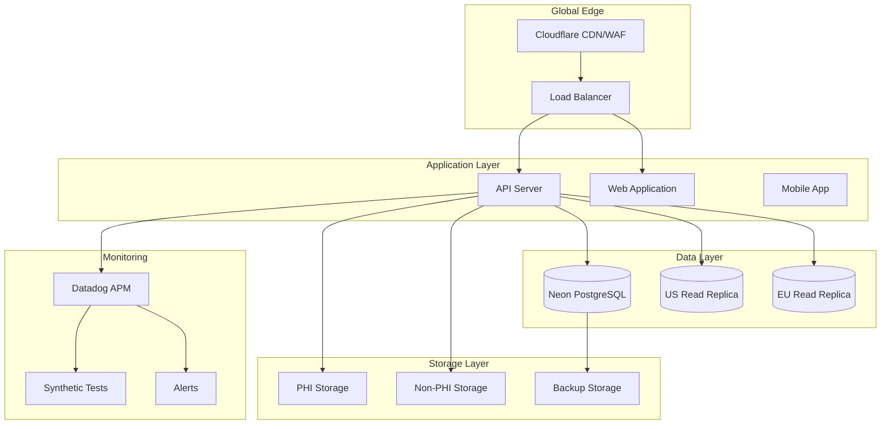

# BioPoint Infrastructure as Code

Comprehensive Terraform-based infrastructure for BioPoint's HIPAA-compliant healthcare platform.

## 🏗️ Architecture Overview



## 📁 Directory Structure

```
infrastructure/
├── terraform/                 # Core Terraform configuration
│   ├── main.tf               # Provider configuration
│   ├── variables.tf          # Input variables
│   ├── outputs.tf            # Output values
│   ├── versions.tf           # Provider versions
│   ├── neon/                 # PostgreSQL database module
│   ├── s3/                   # Cloudflare R2 storage module
│   ├── cloudflare/           # CDN, DNS, WAF module
│   ├── datadog/              # Monitoring and alerting module
│   └── doppler/              # Secrets management module
├── environments/             # Environment-specific configurations
│   ├── dev.tfvars           # Development environment
│   ├── staging.tfvars       # Staging environment
│   └── production.tfvars    # Production environment
├── docs/                     # Documentation
│   ├── terraform-setup.md   # Setup instructions
│   ├── infrastructure-overview.md # Architecture details
│   ├── deployment-procedures.md   # Deployment guide
│   └── variable-reference.md      # Variable reference
└── .github/workflows/        # CI/CD pipelines
    ├── terraform-plan.yml   # Plan workflow
    └── terraform-apply.yml  # Apply workflow
```

## 🚀 Quick Start

### Prerequisites

- [Terraform](https://www.terraform.io/downloads) >= 1.0
- [AWS CLI](https://aws.amazon.com/cli/) configured
- [Doppler CLI](https://docs.doppler.com/docs/install-cli) installed
- API keys for all services (see [Setup Guide](../docs/terraform-setup.md))

### Initial Setup

1. **Clone and navigate to infrastructure directory**
   ```bash
   cd biopoint/infrastructure
   ```

2. **Set up environment variables**
   ```bash
   # Copy and configure environment template
   cp .env.example .env
   # Edit .env with your API keys
   source .env
   ```

3. **Initialize Terraform**
   ```bash
   cd terraform
   terraform init -backend=true
   ```

4. **Select environment workspace**
   ```bash
   terraform workspace new dev      # Development
   terraform workspace new staging  # Staging
   terraform workspace new prod     # Production
   ```

### Deploy Infrastructure

```bash
# Plan changes for development
terraform plan -var-file=../environments/dev.tfvars

# Apply changes (development auto-approves)
terraform apply -var-file=../environments/dev.tfvars -auto-approve

# For staging/production, apply manually after review
terraform apply -var-file=../environments/staging.tfvars
```

## 🏛️ Infrastructure Modules

### Neon PostgreSQL Module

HIPAA-compliant PostgreSQL database with multi-region support.

**Features:**
- ✅ Serverless PostgreSQL with auto-scaling
- ✅ Multi-region read replicas
- ✅ Point-in-time recovery
- ✅ Database branching for development
- ✅ Connection pooling
- ✅ Private network access

**Key Resources:**
- Primary database cluster
- Read replicas (US-West-2, EU-Central-1)
- Automated backups
- Connection pooling endpoints

### Cloudflare R2 Storage Module

HIPAA-compliant object storage with lifecycle management.

**Features:**
- ✅ S3-compatible API
- ✅ No egress fees
- ✅ Multi-region replication
- ✅ Lifecycle policies
- ✅ Server-side encryption
- ✅ Versioning support

**Storage Classes:**
- **PHI Storage**: 7-year retention, encrypted, access-controlled
- **Non-PHI Storage**: 1-year retention, standard security
- **Backup Storage**: Cross-region backups, disaster recovery

### Cloudflare Security Module

Comprehensive security with CDN, WAF, and DDoS protection.

**Features:**
- ✅ Global CDN with 300+ POPs
- ✅ Web Application Firewall (WAF)
- ✅ DDoS protection (L3-L7)
- ✅ Rate limiting and bot management
- ✅ SSL/TLS with HSTS
- ✅ Load balancing with health checks

**Security Rules:**
- OWASP Top 10 protection
- Custom security rules
- Geo-blocking capabilities
- Rate limiting per IP

### Datadog Monitoring Module

Comprehensive monitoring, alerting, and observability.

**Features:**
- ✅ Infrastructure monitoring
- ✅ Application performance monitoring (APM)
- ✅ Synthetic tests and SLO tracking
- ✅ Security monitoring
- ✅ Custom dashboards and alerts
- ✅ Log management and analysis

**Key Metrics:**
- Availability: 99.9% target
- Response time: p95 < 1s target
- Error rate: < 1% target
- Infrastructure health

### Doppler Secrets Module

HIPAA-compliant secrets management with rotation.

**Features:**
- ✅ Environment-specific secrets
- ✅ Automatic secret rotation
- ✅ Audit logging
- ✅ Access controls
- ✅ Integration with external stores
- ✅ Business continuity

**Secret Categories:**
- Database credentials
- API keys and tokens
- Encryption keys
- Third-party integrations

## 🔧 Configuration

### Environment Variables

Set these environment variables before deployment:

```bash
# Cloudflare
export CLOUDFLARE_API_TOKEN="your-token"
export CLOUDFLARE_ACCOUNT_ID="your-account-id"

# Neon Database
export NEON_API_KEY="your-api-key"

# Datadog
export DATADOG_API_KEY="your-api-key"
export DATADOG_APP_KEY="your-app-key"

# Doppler
export DOPPLER_SERVICE_TOKEN="your-service-token"

# AWS (for state backend)
export AWS_ACCESS_KEY_ID="your-access-key"
export AWS_SECRET_ACCESS_KEY="your-secret-key"
```

### Environment-Specific Configuration

Each environment has its own configuration file:

| Environment | File | Purpose | Key Differences |
|-------------|------|---------|-----------------|
| **Development** | `dev.tfvars` | Developer testing | Auto-pause enabled, lower resources, relaxed security |
| **Staging** | `staging.tfvars` | QA and integration | Full features, moderate resources, production-like |
| **Production** | `production.tfvars` | Live application | High availability, maximum security, HIPAA compliance |

## 📊 Monitoring and Alerting

### Infrastructure Metrics

Monitor these key metrics across all environments:

```yaml
Performance Metrics:
  - CPU Utilization: < 80%
  - Memory Utilization: < 85%
  - Disk Utilization: < 90%
  - Network Throughput: Baseline monitoring

Application Metrics:
  - Request Rate: Track trends
  - Response Time: p95 < 1s target
  - Error Rate: < 1% target
  - Database Query Time: < 100ms

Security Metrics:
  - WAF Blocked Requests: Monitor spikes
  - Rate Limiting Triggers: Track patterns
  - Failed Authentication: Monitor for attacks
  - Suspicious Activity: Automated detection
```

### Alert Channels

- **Critical**: PagerDuty integration
- **Warning**: Slack notifications
- **Info**: Email summaries

## 🔒 Security

### Security Features

- **Encryption**: All data encrypted at rest and in transit
- **Access Control**: Role-based access with audit logging
- **Network Security**: VPC isolation and security groups
- **Compliance**: HIPAA, SOC 2, GDPR compliance
- **Monitoring**: 24/7 security monitoring and alerting

### Security Scanning

Automated security scanning includes:

```bash
# Infrastructure security scan
terraform plan -var-file=../environments/dev.tfvars

# Checkov security analysis
checkov -d terraform/ --framework terraform

# tfsec security analysis
tfsec terraform/
```

## 💰 Cost Management

### Monthly Cost Estimates

| Environment | Estimated Cost | Key Cost Drivers |
|-------------|----------------|------------------|
| **Development** | $200-400 | Auto-pause enabled, smaller instances |
| **Staging** | $500-800 | Full features, moderate resources |
| **Production** | $1500-2500 | High availability, maximum performance |

### Cost Optimization

- **Auto-pause**: Automatically pause development databases
- **Lifecycle policies**: Move old data to cheaper storage
- **Right-sizing**: Use appropriate instance sizes
- **Spot instances**: Use where appropriate for compute

## 🔧 Maintenance

### Regular Maintenance Tasks

**Weekly:**
- Review monitoring dashboards
- Check for security alerts
- Verify backup completion

**Monthly:**
- Update Terraform providers
- Review and optimize costs
- Update documentation

**Quarterly:**
- Security assessment
- Performance review
- Disaster recovery testing

### Provider Updates

```bash
# Update Terraform providers
terraform init -upgrade

# Update modules
cd terraform
terraform get -update

# Test updates in development first
terraform plan -var-file=../environments/dev.tfvars
```

## 🚨 Troubleshooting

### Common Issues

1. **Terraform State Lock**
   ```bash
   # Check for existing locks
   terraform force-unlock <LOCK_ID>
   ```

2. **Provider Authentication**
   ```bash
   # Verify Cloudflare API token
   curl -H "Authorization: Bearer $CLOUDFLARE_API_TOKEN" \
        https://api.cloudflare.com/client/v4/user/tokens/verify
   ```

3. **Database Connection Issues**
   ```bash
   # Test database connectivity
   psql $DATABASE_URL -c "SELECT 1"
   ```

### Debug Mode

Enable debug logging:
```bash
export TF_LOG=DEBUG
export TF_LOG_PATH=terraform-debug.log
terraform plan -var-file=../environments/dev.tfvars
```

## 📚 Documentation

### Available Documentation

- **[Setup Guide](docs/terraform-setup.md)**: Complete setup instructions
- **[Architecture Overview](docs/infrastructure-overview.md)**: Detailed architecture
- **[Deployment Procedures](docs/deployment-procedures.md)**: Deployment processes
- **[Variable Reference](docs/variable-reference.md)**: Configuration reference

### Additional Resources

- [Terraform Documentation](https://www.terraform.io/docs/)
- [Cloudflare API Docs](https://api.cloudflare.com/)
- [Neon Documentation](https://neon.tech/docs/)
- [Datadog Documentation](https://docs.datadoghq.com/)
- [Doppler Documentation](https://docs.doppler.com/)

## 🤝 Contributing

### Development Workflow

1. **Create feature branch**
   ```bash
   git checkout -b feature/new-infrastructure-component
   ```

2. **Make changes and test**
   ```bash
   # Test in development environment
   terraform plan -var-file=../environments/dev.tfvars
   terraform apply -var-file=../environments/dev.tfvars
   ```

3. **Create pull request**
   - Include infrastructure plan output
   - Update documentation
   - Add tests if applicable

4. **Review and merge**
   - Peer review required
   - Security scan must pass
   - Cost impact reviewed

### Code Standards

- Follow Terraform best practices
- Use meaningful resource names
- Include comments for complex logic
- Test in development before staging

## 📞 Support

### Getting Help

- **Documentation**: Check this README and linked docs
- **GitHub Issues**: Create an issue for bugs or feature requests
- **Slack**: Post in #infrastructure channel
- **Email**: infrastructure@biopoint.app

### On-Call Support

- **Primary**: Infrastructure team lead
- **Secondary**: Senior DevOps engineer
- **Escalation**: Engineering manager

## 📄 License

This infrastructure code is proprietary to BioPoint and is licensed for internal use only.

---

**Note**: This infrastructure handles Protected Health Information (PHI) and must comply with HIPAA regulations. All changes must be reviewed for compliance impact.